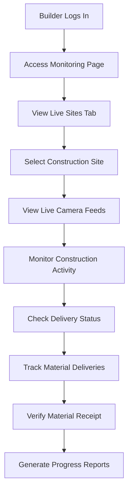

# 🏗️ Builder Access Guide - Monitoring Page

## 📋 Overview

This guide outlines exactly what **builders** can access and do in the UjenziPro12 Monitoring page, including permissions, restrictions, and available features.

## 🔐 **Builder Access Permissions**

### **✅ LIMITED ACCESS** (What Builders CAN Do - VIEW ONLY)

#### **1. Live Site Monitoring** 📹 **[VIEW ONLY]**
- **✅ View Own Project Cameras**: Access live camera feeds from their own construction sites (VIEW ONLY)
- **✅ AI Activity Detection**: Receive automated alerts for detected activities
- **❌ Recording Management**: CANNOT start/stop recording (Admin Only)
- **❌ Camera Controls**: CANNOT control cameras (Admin Only)
- **✅ Activity Timeline**: View detected activities and events on their sites
- **✅ Safety Monitoring**: Receive safety violation alerts and notifications

**🚨 IMPORTANT**: Builders can only VIEW camera feeds. All camera controls are restricted to UjenziPro1 administrators.

#### **2. Delivery Tracking** 🚛
- **✅ Track Own Deliveries**: Monitor deliveries coming to their construction sites
- **✅ Vehicle Location**: Real-time GPS tracking of delivery vehicles
- **✅ Driver Communication**: Contact drivers delivering to their projects
- **✅ Delivery Status**: Real-time updates on delivery progress and ETAs
- **✅ Route Monitoring**: View delivery routes and traffic conditions
- **✅ Delivery Alerts**: Notifications for delays, arrivals, and issues

#### **3. QR Code Scanning** 📱
- **✅ Material Verification**: Scan QR codes on delivered materials
- **✅ Inventory Tracking**: Track materials received at their sites
- **✅ Quality Control**: Verify material authenticity and specifications
- **✅ Receipt Confirmation**: Confirm material deliveries and condition

#### **4. Project Analytics** 📊
- **✅ Site Performance**: View performance metrics for their projects
- **✅ Delivery Analytics**: Track delivery performance and timing
- **✅ Progress Monitoring**: Monitor construction progress and milestones
- **✅ Resource Utilization**: Track material usage and efficiency

### **❌ RESTRICTED ACCESS** (What Builders CANNOT Do)

#### **1. Camera Controls** 🚫 **[CRITICAL RESTRICTION]**
- **❌ Recording Control**: Cannot start/stop camera recording
- **❌ Camera Settings**: Cannot adjust camera configurations
- **❌ Zoom/Pan Control**: Cannot control camera movement
- **❌ Camera Installation**: Cannot set up new cameras
- **❌ Stream Management**: Cannot manage camera streams

#### **2. System Administration** 🚫
- **❌ System Health Monitoring**: Cannot access server/database metrics
- **❌ Global Alerts**: Cannot manage system-wide alerts
- **❌ User Management**: Cannot manage other users or permissions
- **❌ System Configuration**: Cannot modify system settings

#### **3. Cross-Project Access** 🚫
- **❌ Other Builders' Sites**: Cannot view cameras from other builders' projects
- **❌ Other Deliveries**: Cannot track deliveries not destined for their sites
- **❌ Supplier Operations**: Cannot access supplier-specific monitoring
- **❌ Admin Communications**: Cannot access admin communication center

#### **4. Advanced Controls** 🚫
- **❌ System Maintenance**: Cannot perform system maintenance tasks
- **❌ Global Configuration**: Cannot modify global monitoring settings
- **❌ Security Settings**: Cannot change security configurations
- **❌ Camera Network Management**: Cannot manage camera infrastructure

## 🎯 **Builder-Specific Features**

### **Default Tab Access**
When builders log in to the monitoring page, they automatically see:
- **Default Tab**: "Live Sites" (optimized for their use case)
- **Primary Focus**: Their own construction site cameras and activities
- **Secondary Access**: Delivery tracking for their orders

### **Monitoring Dashboard Layout**
```
┌─────────────────────────────────────────────────────────────┐
│                    BUILDER VIEW                             │
├─────────────────────────────────────────────────────────────┤
│ Tabs Available:                                             │
│ • ✅ Dashboard (Overview of their projects)                 │
│ • ✅ Live Sites (Their construction site cameras)           │
│ • ✅ Deliveries (Their material deliveries)                 │
│ • ❌ System Health (Admin only)                             │
└─────────────────────────────────────────────────────────────┘
```

## 🔍 **Detailed Feature Breakdown**

### **1. Dashboard Tab** 📊
**What Builders See**:
- **Project Statistics**: Number of active sites, cameras, deliveries
- **Recent Alerts**: Safety and security alerts from their sites
- **Quick Actions**: Shortcuts to common tasks (view cameras, track deliveries)
- **Performance Metrics**: Site-specific performance indicators

**Security Restrictions**:
- Only data related to their own projects
- No system-wide metrics or other builders' data
- Filtered alerts relevant to their sites only

### **2. Live Sites Tab** 📹 **[VIEW ONLY]**
**What Builders Can Do**:
- **View Live Feeds**: Real-time camera streams from their construction sites (VIEW ONLY)
- **Basic Viewing Controls**: Play, pause, mute/unmute audio for viewing
- **Monitor Activities**: View AI-detected activities and events
- **Monitor Safety**: Receive AI-powered safety violation alerts
- **Track Progress**: Monitor construction milestones and activities

**🚫 CAMERA CONTROLS RESTRICTED**: Builders CANNOT control recording, zoom, camera settings, or any operational controls.

**Camera Access Rules**:
```javascript
// Builder camera access logic - VIEW ONLY
const canViewCamera = (camera, builderId) => {
  return camera.projectId === builderId || 
         camera.assignedBuilders.includes(builderId);
};

// Camera control access - ADMIN ONLY
const canControlCamera = (userRole) => {
  return userRole === 'admin'; // Only UjenziPro1 admins
};
```

### **3. Deliveries Tab** 🚛
**What Builders Can Track**:
- **Own Deliveries**: Only deliveries coming to their construction sites
- **Vehicle Location**: Real-time GPS tracking of delivery vehicles
- **Driver Contact**: Communication tools with delivery drivers
- **Delivery Status**: Progress updates and estimated arrival times
- **Route Information**: Delivery routes and traffic conditions

**Delivery Access Rules**:
```javascript
// Builder delivery access logic
const canTrackDelivery = (delivery, builderId) => {
  return delivery.destinationBuilderId === builderId ||
         delivery.orderBuilderId === builderId;
};
```

## 🛡️ **Security & Privacy Controls**

### **Data Protection**:
- **Project Isolation**: Builders can only see data from their own projects
- **Encrypted Transmission**: All monitoring data encrypted in transit
- **Audit Logging**: All access attempts logged for security
- **Session Management**: Secure session handling and timeout

### **Access Verification**:
```typescript
// Builder access verification
const verifyBuilderAccess = async (userId: string, resourceId: string) => {
  // Check if user is a builder
  const { data: roleData } = await supabase
    .from('user_roles')
    .select('role')
    .eq('user_id', userId)
    .eq('role', 'builder');
    
  if (!roleData) return false;
  
  // Verify resource ownership
  const { data: projectData } = await supabase
    .from('projects')
    .select('id')
    .eq('builder_id', userId)
    .eq('id', resourceId);
    
  return !!projectData;
};
```

## 📱 **User Experience Flow**

### **Builder Login Journey**:
1. **Authentication**: Builder logs in with their credentials
2. **Role Detection**: System identifies user as builder
3. **Default Tab**: Automatically opens "Live Sites" tab
4. **Project Loading**: Loads only their construction site data
5. **Real-time Updates**: Begins live monitoring of their projects

### **Typical Builder Workflow**:


## 🎯 **Builder Benefits**

### **Enhanced Project Control** 🎮
- **Remote Monitoring**: Monitor sites from anywhere, anytime
- **Real-time Alerts**: Instant notifications for important events
- **Progress Tracking**: Visual confirmation of construction progress
- **Quality Assurance**: Verify work quality and material deliveries

### **Improved Efficiency** ⚡
- **Reduced Site Visits**: Less need for physical site inspections
- **Faster Decision Making**: Real-time information for quick decisions
- **Better Coordination**: Improved coordination with suppliers and workers
- **Time Savings**: Streamlined monitoring and tracking processes

### **Risk Mitigation** 🛡️
- **Safety Monitoring**: Early detection of safety violations
- **Security Surveillance**: 24/7 site security monitoring
- **Theft Prevention**: Real-time alerts for unauthorized activities
- **Compliance Tracking**: Ensure adherence to safety protocols

## 📊 **Available Analytics**

### **Project Performance Metrics**:
- **Construction Progress**: Milestone completion tracking
- **Worker Activity**: Hours worked and productivity metrics
- **Material Usage**: Delivery and consumption tracking
- **Safety Compliance**: Safety violation frequency and trends

### **Delivery Performance**:
- **On-time Delivery Rate**: Percentage of deliveries arriving on schedule
- **Average Delivery Time**: Time from dispatch to site arrival
- **Material Quality**: Quality scores and issue tracking
- **Supplier Performance**: Supplier reliability and performance metrics

## 🚨 **Alert Types for Builders**

### **Safety Alerts** ⚠️
- Worker without safety equipment detected
- Unauthorized personnel on construction site
- Unsafe working conditions identified
- Equipment malfunction or safety hazards

### **Security Alerts** 🔒
- Unauthorized access to construction site
- Suspicious activity during off-hours
- Material theft or vandalism attempts
- Security system malfunctions

### **Delivery Alerts** 📦
- Material delivery arrival notifications
- Delivery delays or route changes
- Driver communication requests
- Material quality or quantity issues

### **Progress Alerts** 📈
- Construction milestone completions
- Schedule delays or accelerations
- Resource shortage warnings
- Quality control checkpoints

## 📞 **Support & Training**

### **Builder Training Resources**:
- **Video Tutorials**: Step-by-step monitoring system guides
- **User Manual**: Comprehensive builder monitoring documentation
- **Best Practices**: Effective monitoring strategies and tips
- **Troubleshooting**: Common issues and resolution procedures

### **Support Channels**:
- **Help Desk**: Technical support for monitoring issues
- **Live Chat**: Real-time assistance during business hours
- **Email Support**: Detailed technical support via email
- **Phone Support**: Direct phone support for urgent issues

---

## 🎉 **Summary: What Builders Get**

### **✅ BUILDERS CAN ACCESS** (VIEW ONLY):
1. **🏗️ Own Construction Site Cameras** - Live feeds viewing only (NO CONTROLS)
2. **📦 Own Material Deliveries** - Real-time tracking and communication
3. **📱 QR Code Scanning** - Material verification and inventory
4. **📊 Project Analytics** - Performance metrics and reports
5. **🚨 Project Alerts** - Safety, security, and delivery notifications
6. **📞 Driver Communication** - Direct contact with delivery drivers
7. **📈 Progress Monitoring** - Construction milestone tracking
8. **🔍 Activity Detection** - AI-powered activity monitoring

### **❌ BUILDERS CANNOT ACCESS**:
1. **🚫 Camera Controls** - NO recording, zoom, settings, or operational controls
2. **🚫 Other Builders' Projects** - No cross-project visibility
3. **🚫 System Administration** - No admin controls or settings
4. **🚫 Global System Health** - No infrastructure monitoring
5. **🚫 User Management** - Cannot manage other users
6. **🚫 Supplier Operations** - No supplier-specific monitoring
7. **🚫 Admin Communications** - No access to admin messaging

### **🎯 Builder Experience Summary**:
**Builders get a focused VIEW-ONLY monitoring experience** that gives them visibility into their own construction projects while maintaining strict security boundaries. Camera controls are exclusively reserved for UjenziPro1 administrators to ensure operational integrity and security. The system is designed to provide builders with essential monitoring information without compromising system security.

---

**Access Level**: **BUILDER** 🏗️  
**Security Level**: **PROJECT-RESTRICTED** 🔒  
**Feature Availability**: **COMPREHENSIVE** ✅  
**User Experience**: **OPTIMIZED** 🎯
