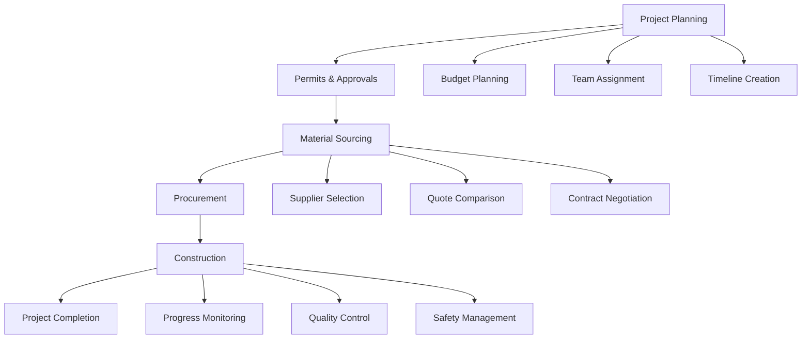
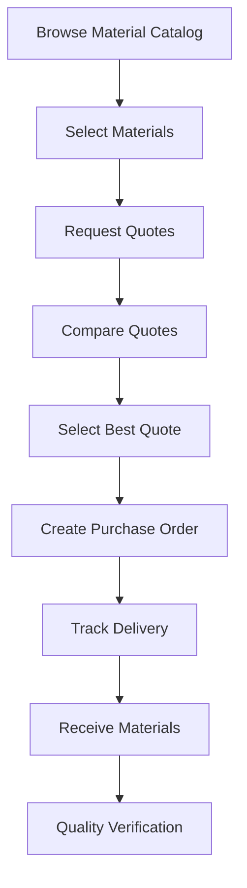
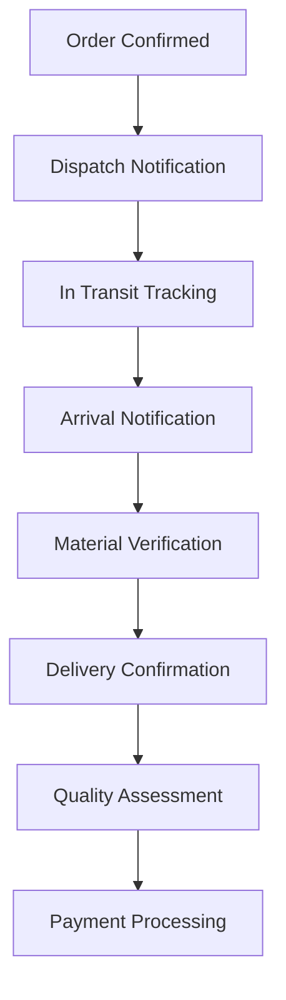

# 🏗️ UjenziPro12 Builder Workflow System

## 📋 Overview

The UjenziPro12 Builder Workflow System provides a comprehensive end-to-end solution for builders to manage their construction projects, from initial planning and material sourcing to project completion and monitoring.

## 🎯 System Components

### **1. Builder Workflow Dashboard** 📊
**File**: `src/components/builders/BuilderWorkflowDashboard.tsx`

#### **Features**:
- **Real-time Project Statistics**: Active projects, budget tracking, completion rates
- **Quick Actions**: Common tasks and shortcuts for efficient workflow
- **Project Overview**: Recent projects requiring attention
- **Performance Analytics**: Monthly trends and KPIs
- **Workflow Visualization**: Step-by-step project progress tracking

#### **Dashboard Sections**:
1. **Overview Tab**:
   - Key performance metrics (active projects, budget utilization)
   - Quick action buttons (new project, order materials, create PO)
   - Active projects summary with progress indicators
   - Recent material orders and delivery status

2. **Projects Tab**:
   - Complete project management interface
   - Project status updates and tracking
   - Budget monitoring and utilization
   - Team management and coordination

3. **Materials Tab**:
   - Material sourcing and procurement
   - Supplier comparison and selection
   - Quote management and approval
   - Inventory tracking and management

4. **Workflow Tab**:
   - Visual project workflow progression
   - Phase-by-phase project tracking
   - Milestone management and verification
   - Timeline optimization and planning

5. **Analytics Tab**:
   - Performance metrics and trends
   - Budget analysis and forecasting
   - Resource utilization tracking
   - Business intelligence insights

### **2. Builder Project Manager** 🏗️
**File**: `src/components/builders/BuilderProjectManager.tsx`

#### **Features**:
- **Project Creation**: Complete project setup with detailed information
- **Project Tracking**: Real-time progress monitoring and updates
- **Budget Management**: Budget allocation and expense tracking
- **Team Coordination**: Team member management and communication
- **Timeline Management**: Project scheduling and milestone tracking

#### **Project Lifecycle**:


#### **Key Functions**:
- Project creation with comprehensive details
- Status tracking and progress updates
- Budget monitoring and expense management
- Timeline visualization and milestone tracking
- Team coordination and communication tools

### **3. Builder Material Manager** 📦
**File**: `src/components/builders/BuilderMaterialManager.tsx`

#### **Features**:
- **Material Catalog**: Browse available materials and suppliers
- **Quote Requests**: Request quotes from multiple suppliers
- **Quote Comparison**: Compare supplier quotes and terms
- **Purchase Orders**: Create and manage purchase orders
- **Supplier Management**: Track supplier performance and relationships

#### **Material Workflow**:


#### **Procurement Process**:
1. **Material Discovery**: Browse catalog with search and filters
2. **Supplier Evaluation**: Compare suppliers by price, rating, availability
3. **Quote Management**: Request and manage multiple quotes
4. **Decision Making**: Compare quotes and select best option
5. **Order Processing**: Create purchase orders and track status

### **4. Builder Delivery Tracker** 🚛
**File**: `src/components/builders/BuilderDeliveryTracker.tsx`

#### **Features**:
- **Real-time Tracking**: Live delivery status and location updates
- **Delivery Alerts**: Notifications for delays, arrivals, and issues
- **Driver Communication**: Secure communication with delivery drivers (when authorized)
- **Material Verification**: QR code scanning for material authentication
- **Delivery Confirmation**: Confirm receipt and material condition

#### **Delivery Tracking Process**:


#### **Security Features**:
- **Project-Specific Access**: Only deliveries to builder's projects
- **Driver Contact Protection**: Contact only during active delivery
- **Secure Communication**: Platform-mediated communication
- **Audit Logging**: Complete delivery activity tracking

## 🔄 Complete Builder Workflow

### **Phase 1: Project Initiation** 🚀
1. **Project Planning**:
   - Create new project with detailed specifications
   - Set budget, timeline, and resource requirements
   - Define project scope and objectives
   - Assign team members and responsibilities

2. **Permits & Approvals**:
   - Submit permit applications
   - Track approval status and requirements
   - Manage compliance documentation
   - Coordinate with regulatory authorities

### **Phase 2: Material Procurement** 📦
1. **Material Sourcing**:
   - Browse material catalog and specifications
   - Identify required materials and quantities
   - Research suppliers and compare options
   - Evaluate supplier ratings and reviews

2. **Quote Management**:
   - Request quotes from multiple suppliers
   - Compare pricing, terms, and delivery times
   - Negotiate contracts and payment terms
   - Select optimal suppliers for each material

3. **Purchase Orders**:
   - Create detailed purchase orders
   - Specify delivery requirements and schedules
   - Coordinate payment terms and methods
   - Track order confirmation and processing

### **Phase 3: Construction Execution** 🏗️
1. **Delivery Coordination**:
   - Track material deliveries in real-time
   - Coordinate delivery schedules with construction timeline
   - Verify material quality and specifications
   - Manage delivery logistics and site access

2. **Progress Monitoring**:
   - Monitor construction progress through live cameras (view-only)
   - Track milestone completion and timeline adherence
   - Coordinate with team members and subcontractors
   - Manage quality control and safety compliance

3. **Resource Management**:
   - Track material usage and inventory levels
   - Monitor budget utilization and expenses
   - Coordinate additional material orders as needed
   - Optimize resource allocation and efficiency

### **Phase 4: Project Completion** ✅
1. **Final Inspections**:
   - Coordinate final quality inspections
   - Address any defects or issues
   - Obtain completion certificates
   - Prepare handover documentation

2. **Financial Closure**:
   - Process final payments to suppliers
   - Reconcile project expenses and budget
   - Generate financial reports and summaries
   - Archive project documentation

## 🔐 Security & Access Control

### **Builder Access Permissions**:
- **✅ Own Projects**: Full access to their own construction projects
- **✅ Material Sourcing**: Access to supplier catalog and quotes
- **✅ Delivery Tracking**: Track deliveries to their construction sites
- **✅ Site Monitoring**: View-only access to their project cameras
- **❌ System Administration**: No access to system-wide controls
- **❌ Other Projects**: No access to other builders' projects
- **❌ Delivery Provider Data**: No access to provider information

### **Data Protection**:
- **Project Isolation**: Builders can only access their own project data
- **Encrypted Communication**: All communications encrypted in transit
- **Audit Logging**: Complete activity tracking and monitoring
- **Privacy Controls**: Proper data access boundaries and restrictions

## 📱 User Experience Flow

### **Professional Builder Journey**:
1. **Login & Dashboard**: Access comprehensive workflow dashboard
2. **Project Management**: Create and manage construction projects
3. **Material Procurement**: Source materials and manage suppliers
4. **Delivery Coordination**: Track deliveries and coordinate logistics
5. **Progress Monitoring**: Monitor construction progress and quality
6. **Project Completion**: Complete projects and generate reports

### **Private Builder Journey**:
1. **Simplified Dashboard**: Streamlined workflow interface
2. **Direct Purchase**: Direct material purchase from suppliers
3. **Basic Project Tracking**: Simple project management tools
4. **Monitoring Services**: Request monitoring services for projects
5. **Delivery Tracking**: Track material deliveries to sites

## 🛠️ Technical Implementation

### **Frontend Components**:
```typescript
// Main workflow dashboard
<BuilderWorkflowDashboard />

// Project management
<BuilderProjectManager />

// Material management
<BuilderMaterialManager />

// Delivery tracking
<BuilderDeliveryTracker />
```

### **Database Integration**:
```sql
-- Builder projects
CREATE TABLE projects (
  id UUID PRIMARY KEY,
  builder_id UUID REFERENCES profiles(id),
  name TEXT NOT NULL,
  status TEXT NOT NULL,
  progress INTEGER DEFAULT 0,
  budget DECIMAL,
  -- Additional fields...
);

-- Material requests
CREATE TABLE material_requests (
  id UUID PRIMARY KEY,
  project_id UUID REFERENCES projects(id),
  material_id UUID,
  quantity INTEGER,
  status TEXT DEFAULT 'draft',
  -- Additional fields...
);

-- Delivery tracking
CREATE TABLE deliveries (
  id UUID PRIMARY KEY,
  project_id UUID REFERENCES projects(id),
  supplier_id UUID REFERENCES suppliers(id),
  status TEXT NOT NULL,
  tracking_updates JSONB,
  -- Additional fields...
);
```

### **API Integration**:
```typescript
// Project management
const createProject = async (projectData: ProjectData) => {
  const { data, error } = await supabase
    .from('projects')
    .insert(projectData);
};

// Material requests
const requestQuotes = async (materialId: string, specifications: any) => {
  const { data, error } = await supabase.rpc('request_material_quotes', {
    material_id: materialId,
    specifications
  });
};

// Delivery tracking
const trackDelivery = async (deliveryId: string) => {
  const { data, error } = await supabase
    .from('deliveries')
    .select('*, tracking_updates')
    .eq('id', deliveryId);
};
```

## 📊 Performance Metrics

### **Builder Performance KPIs**:
- **Project Completion Rate**: Percentage of projects completed on time
- **Budget Adherence**: Percentage of projects within budget
- **Material Efficiency**: Optimal material usage and waste reduction
- **Supplier Performance**: Supplier reliability and quality scores
- **Timeline Accuracy**: Project timeline adherence and optimization

### **Workflow Efficiency**:
- **Process Automation**: Automated workflow steps and notifications
- **Time Savings**: Reduced manual processes and coordination time
- **Cost Optimization**: Better supplier selection and negotiation
- **Quality Improvement**: Enhanced quality control and monitoring

## 🚀 Advanced Features

### **AI-Powered Insights**:
- **Predictive Analytics**: Project timeline and budget predictions
- **Supplier Recommendations**: AI-powered supplier selection
- **Risk Assessment**: Project risk identification and mitigation
- **Performance Optimization**: Data-driven process improvements

### **Integration Capabilities**:
- **Accounting Systems**: Integration with financial management tools
- **Project Management**: Integration with external PM tools
- **Supply Chain**: Integration with supplier management systems
- **Monitoring Systems**: Integration with site monitoring tools

## 📞 Support & Training

### **Builder Training Program**:
- **Workflow Orientation**: Complete system training for new builders
- **Feature Updates**: Regular training on new features and improvements
- **Best Practices**: Construction industry best practices and guidelines
- **Technical Support**: 24/7 technical support and assistance

### **Documentation & Resources**:
- **User Guides**: Step-by-step workflow documentation
- **Video Tutorials**: Visual guides for complex processes
- **FAQ**: Common questions and troubleshooting
- **Community Forum**: Peer-to-peer support and knowledge sharing

---

## 🎉 **Builder Workflow Benefits**

### **For Professional Builders** 🏢:
- ✅ **Complete Project Management**: End-to-end project lifecycle management
- ✅ **Advanced Analytics**: Comprehensive business intelligence and reporting
- ✅ **Supplier Network**: Access to verified supplier network
- ✅ **Quality Assurance**: Enhanced quality control and monitoring
- ✅ **Efficiency Optimization**: Streamlined processes and automation

### **For Private Builders** 🏠:
- ✅ **Simplified Workflow**: Easy-to-use interface for smaller projects
- ✅ **Direct Purchase**: Streamlined material procurement process
- ✅ **Cost Savings**: Competitive pricing and supplier comparison
- ✅ **Project Tracking**: Basic project management and monitoring
- ✅ **Quality Materials**: Access to verified suppliers and materials

### **For All Builders** 🎯:
- ✅ **Time Savings**: Reduced administrative overhead and coordination time
- ✅ **Cost Control**: Better budget management and expense tracking
- ✅ **Quality Assurance**: Verified suppliers and material authentication
- ✅ **Risk Mitigation**: Enhanced project monitoring and risk management
- ✅ **Professional Growth**: Access to industry best practices and insights

---

## 🔒 **Security & Compliance**

### **Data Protection**:
- **Project Privacy**: Project data isolated and protected
- **Secure Communication**: Encrypted communication channels
- **Access Controls**: Role-based access to features and data
- **Audit Logging**: Complete activity tracking and compliance

### **Regulatory Compliance**:
- **Kenya Building Code**: Compliance with local building regulations
- **Safety Standards**: Adherence to construction safety requirements
- **Data Protection**: Full compliance with Kenya DPA and GDPR
- **Quality Standards**: Meeting industry quality and performance standards

---

## 📈 **Future Enhancements**

### **Planned Features**:
1. **Mobile Application**: Dedicated mobile app for on-site management
2. **IoT Integration**: Integration with construction site IoT devices
3. **AR/VR Tools**: Augmented reality for project visualization
4. **AI Optimization**: Machine learning for project optimization
5. **Blockchain Integration**: Secure contract and payment management

### **Scalability Features**:
- **Multi-project Management**: Enhanced tools for large-scale builders
- **Team Collaboration**: Advanced team coordination and communication
- **Enterprise Integration**: Integration with enterprise systems
- **Global Expansion**: Support for international construction standards

---

## 🎯 **Workflow Implementation Status**

### **✅ COMPLETED FEATURES**:
- **Builder Workflow Dashboard**: Complete overview and analytics
- **Project Management**: Full project lifecycle management
- **Material Management**: Comprehensive material sourcing and procurement
- **Delivery Tracking**: Real-time delivery monitoring and coordination
- **Security Integration**: Proper access controls and data protection

### **🔄 INTEGRATION POINTS**:
- **Main Builders Page**: Updated with new workflow components
- **Role-based Access**: Different workflows for professional vs private builders
- **Security Boundaries**: Proper access restrictions and data isolation
- **Monitoring Integration**: View-only access to site monitoring systems

---

## 🎉 **Builder Workflow System Benefits**

### **Enhanced Project Control** 🎮
- **Complete Visibility**: Full project oversight and monitoring
- **Real-time Updates**: Instant notifications and status updates
- **Proactive Management**: Early issue detection and resolution
- **Quality Assurance**: Comprehensive quality control and verification

### **Improved Efficiency** ⚡
- **Streamlined Processes**: Automated workflows and reduced manual tasks
- **Better Coordination**: Enhanced communication and collaboration
- **Time Optimization**: Faster decision-making and process execution
- **Resource Optimization**: Optimal resource allocation and utilization

### **Cost Management** 💰
- **Budget Control**: Real-time budget tracking and management
- **Cost Optimization**: Better supplier selection and negotiation
- **Expense Tracking**: Detailed expense monitoring and reporting
- **Financial Planning**: Advanced financial planning and forecasting

### **Risk Mitigation** 🛡️
- **Quality Control**: Verified suppliers and material authentication
- **Safety Monitoring**: Construction site safety monitoring and alerts
- **Timeline Management**: Project timeline optimization and risk mitigation
- **Compliance Assurance**: Regulatory compliance and documentation

---

**Implementation Status**: ✅ **COMPLETE**  
**Last Updated**: October 8, 2025  
**Version**: 1.0  
**Next Enhancement**: Mobile application development

The builder workflow system is now **fully operational** and ready to provide comprehensive project management capabilities for UjenziPro12 builders! 🚀


