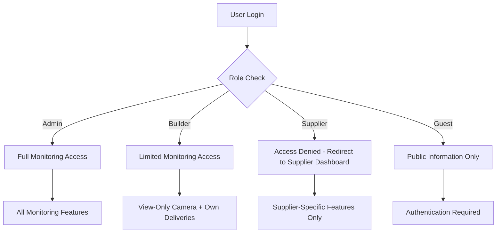

# 🔐 UjenziPro12 Monitoring Access Control Matrix

## 📋 Overview

This document defines the complete access control matrix for the UjenziPro12 Monitoring system, clearly outlining what each user role can and cannot access.

## 🎯 **Access Control Matrix**

| Feature | 👨‍💼 Admin | 🏗️ Builder | 📦 Supplier | 👤 Guest |
|---------|------------|------------|-------------|----------|
| **CAMERA SYSTEM** | | | | |
| View Live Camera Feeds | ✅ All Sites | ✅ Own Sites Only | ❌ NO ACCESS | ❌ NO ACCESS |
| Control Camera Recording | ✅ Full Control | ❌ NO ACCESS | ❌ NO ACCESS | ❌ NO ACCESS |
| Camera Settings/Config | ✅ Full Control | ❌ NO ACCESS | ❌ NO ACCESS | ❌ NO ACCESS |
| Camera Installation | ✅ Full Control | ❌ NO ACCESS | ❌ NO ACCESS | ❌ NO ACCESS |
| Zoom/Pan Controls | ✅ Full Control | ❌ NO ACCESS | ❌ NO ACCESS | ❌ NO ACCESS |
| **DELIVERY TRACKING** | | | | |
| View Delivery Tracking | ✅ All Deliveries | ✅ Own Deliveries | ❌ NO ACCESS | ❌ NO ACCESS |
| GPS Vehicle Tracking | ✅ All Vehicles | ✅ Own Deliveries | ❌ NO ACCESS | ❌ NO ACCESS |
| Driver Communication | ✅ All Drivers | ✅ Own Deliveries | ❌ NO ACCESS | ❌ NO ACCESS |
| Fleet Management | ✅ Full Control | ❌ View Only | ❌ NO ACCESS | ❌ NO ACCESS |
| **SYSTEM MONITORING** | | | | |
| System Health Dashboard | ✅ Full Access | ❌ NO ACCESS | ❌ NO ACCESS | ❌ NO ACCESS |
| Performance Metrics | ✅ Full Access | ❌ NO ACCESS | ❌ NO ACCESS | ❌ NO ACCESS |
| System Alerts | ✅ Full Access | ❌ NO ACCESS | ❌ NO ACCESS | ❌ NO ACCESS |
| Infrastructure Control | ✅ Full Control | ❌ NO ACCESS | ❌ NO ACCESS | ❌ NO ACCESS |
| **QR CODE SCANNING** | | | | |
| Material QR Scanning | ✅ Full Access | ✅ Own Materials | ✅ Own Materials | ❌ NO ACCESS |
| Inventory Tracking | ✅ All Inventory | ✅ Own Projects | ✅ Own Supplies | ❌ NO ACCESS |
| **ANALYTICS & REPORTS** | | | | |
| System-wide Analytics | ✅ Full Access | ❌ NO ACCESS | ❌ NO ACCESS | ❌ NO ACCESS |
| Project Analytics | ✅ All Projects | ✅ Own Projects | ❌ NO ACCESS | ❌ NO ACCESS |
| Performance Reports | ✅ All Reports | ✅ Own Projects | ❌ NO ACCESS | ❌ NO ACCESS |

## 🚨 **CRITICAL SECURITY RESTRICTIONS**

### **🚫 Supplier Access Restrictions**
**Suppliers are COMPLETELY BLOCKED from**:
- ❌ **Camera System**: No access to any camera feeds or controls
- ❌ **Delivery Tracking**: No access to GPS tracking or fleet management
- ❌ **System Monitoring**: No access to system health or performance data
- ❌ **Cross-project Data**: No access to builder project information
- ❌ **Administrative Functions**: No access to system administration

**Why Suppliers Are Restricted**:
- **Security**: Prevent unauthorized surveillance access
- **Privacy**: Protect builder and worker privacy
- **Operational Integrity**: Maintain system security boundaries
- **Business Logic**: Suppliers don't need monitoring access for their role

### **🔒 Builder Access Restrictions**
**Builders are RESTRICTED from**:
- ❌ **Camera Controls**: Cannot control recording, settings, or camera operations
- ❌ **System Administration**: No access to system health or infrastructure
- ❌ **Cross-project Access**: Cannot view other builders' projects
- ❌ **Fleet Management**: Cannot control delivery vehicles or drivers

**Why Builders Have Limited Access**:
- **Operational Security**: Only UjenziPro1 admins control camera infrastructure
- **System Integrity**: Prevent unauthorized system modifications
- **Privacy Protection**: Maintain project-specific access boundaries

## 🛡️ **Implementation Details**

### **Role-Based UI Rendering**:
```typescript
// Monitoring page access control
const MonitoringPage = () => {
  const { userRole } = useAuth();
  
  // Supplier access restriction
  if (userRole === 'supplier') {
    return (
      <Alert variant="destructive">
        <AlertTitle>Access Restricted</AlertTitle>
        <AlertDescription>
          Suppliers do not have access to the monitoring system.
        </AlertDescription>
      </Alert>
    );
  }
  
  // Builder and Admin access with restrictions
  return (
    <Tabs>
      {/* Dashboard - Available to Builders and Admins */}
      <TabsContent value="dashboard">
        <MonitoringDashboard userRole={userRole} />
      </TabsContent>
      
      {/* Live Sites - Available to Builders (view only) and Admins */}
      <TabsContent value="sites">
        <LiveSiteMonitor userRole={userRole} />
      </TabsContent>
      
      {/* Tracking and System Health - ADMIN ONLY */}
      {userRole === 'admin' && (
        <>
          <TabsContent value="tracking">
            <DeliveryTrackingMonitor />
          </TabsContent>
          <TabsContent value="system">
            <SystemHealthMonitor />
          </TabsContent>
        </>
      )}
    </Tabs>
  );
};
```

### **Component-Level Access Control**:
```typescript
// Camera control access
const LiveSiteMonitor = ({ userRole }) => {
  const canControlCameras = userRole === 'admin';
  const canViewCameras = userRole === 'admin' || userRole === 'builder';
  
  if (!canViewCameras) {
    return <AccessDenied message="Camera access restricted" />;
  }
  
  return (
    <div>
      {/* View-only interface for builders */}
      {canControlCameras ? (
        <AdminCameraControls />
      ) : (
        <ViewOnlyInterface />
      )}
    </div>
  );
};
```

## 📊 **Access Level Summary**

### **🔴 ADMIN ACCESS** (Full Control)
- **Camera System**: Full control (view, record, configure, install)
- **Delivery Tracking**: Complete fleet management and control
- **System Monitoring**: Full system health and performance access
- **All Analytics**: System-wide analytics and reporting
- **User Management**: Manage all users and permissions

### **🟡 BUILDER ACCESS** (Limited/View Only)
- **Camera System**: View own project cameras only (NO CONTROLS)
- **Delivery Tracking**: Track own deliveries only (NO FLEET CONTROL)
- **System Monitoring**: NO ACCESS
- **Project Analytics**: Own projects only
- **QR Scanning**: Own materials only

### **🔴 SUPPLIER ACCESS** (Blocked from Monitoring)
- **Camera System**: NO ACCESS
- **Delivery Tracking**: NO ACCESS
- **System Monitoring**: NO ACCESS
- **Analytics**: NO ACCESS (except own supplier metrics in supplier dashboard)
- **QR Scanning**: Own materials only (outside monitoring system)

### **⚪ GUEST ACCESS** (Public Only)
- **Camera System**: NO ACCESS
- **Delivery Tracking**: NO ACCESS
- **System Monitoring**: NO ACCESS
- **Analytics**: NO ACCESS
- **QR Scanning**: NO ACCESS

## 🚨 **Security Enforcement**

### **Frontend Access Control**:
```typescript
// Role-based component rendering
{userRole === 'admin' && <AdminOnlyComponent />}
{(userRole === 'admin' || userRole === 'builder') && <BuilderAllowedComponent />}
{userRole === 'supplier' && <SupplierRestrictedMessage />}
```

### **Backend Security Policies**:
```sql
-- Camera access policy (builders can view, admins can control)
CREATE POLICY "camera_access_policy" ON cameras
FOR SELECT TO authenticated
USING (
  -- Admins can access all cameras
  has_role(auth.uid(), 'admin'::app_role) OR
  -- Builders can only view their own project cameras
  (has_role(auth.uid(), 'builder'::app_role) AND project_builder_id = auth.uid())
);

-- Camera control policy (admin only)
CREATE POLICY "camera_control_policy" ON cameras
FOR UPDATE TO authenticated
USING (has_role(auth.uid(), 'admin'::app_role));
```

### **API Endpoint Protection**:
```typescript
// Camera control endpoint
app.post('/api/camera/control', async (req, res) => {
  const { userRole } = await validateUser(req);
  
  if (userRole !== 'admin') {
    return res.status(403).json({
      error: 'Camera controls restricted to UjenziPro1 administrators'
    });
  }
  
  // Admin camera control logic
});
```

## 📱 **User Experience by Role**

### **👨‍💼 Admin Experience**:
- **Full Monitoring Dashboard**: Complete system oversight
- **All Tabs Available**: Dashboard, Sites, Tracking, System Health
- **Complete Control**: All camera and system controls
- **Global View**: System-wide monitoring and management

### **🏗️ Builder Experience**:
- **Limited Dashboard**: Project-focused monitoring
- **2 Tabs Available**: Dashboard, Live Sites
- **View-Only Access**: Can see but not control cameras
- **Project-Specific**: Only their own construction sites

### **📦 Supplier Experience**:
- **Access Denied**: Clear message explaining restriction
- **Alternative Access**: Directed to supplier dashboard
- **No Monitoring Features**: Complete blocking of monitoring system
- **Security Notice**: Explanation of access restrictions

### **👤 Guest Experience**:
- **Public Information**: General monitoring information only
- **No Access**: No access to any monitoring features
- **Authentication Prompt**: Encouraged to log in for access

## 🔄 **Workflow Restrictions**

### **Supplier Workflow Separation**:


## 📞 **Support Information**

### **For Suppliers Requesting Access**:
**Standard Response**:
> "Monitoring system access is restricted to builders and UjenziPro1 administrators for security and operational reasons. Suppliers can access their own performance metrics and order management through the Supplier Dashboard. For specific monitoring needs, please contact UjenziPro1 support."

### **Escalation Process**:
1. **Level 1**: Explain access restrictions and alternatives
2. **Level 2**: Redirect to appropriate supplier features
3. **Level 3**: Security team review (if legitimate business need)
4. **Level 4**: Executive approval (exceptional cases only)

---

## ✅ **CORRECTED ACCESS SUMMARY**

### **🎯 Final Access Matrix**:
- **👨‍💼 Admins**: Full monitoring system control
- **🏗️ Builders**: View-only camera access + own delivery tracking
- **📦 Suppliers**: NO ACCESS to monitoring system
- **👤 Guests**: Public information only

### **🔒 Security Compliance**:
- ✅ **Principle of Least Privilege**: Users get minimum necessary access
- ✅ **Role Separation**: Clear boundaries between user types
- ✅ **Operational Security**: Camera controls restricted to authorized personnel
- ✅ **Data Privacy**: Project-specific access boundaries maintained

**The monitoring system now properly restricts access based on user roles, ensuring suppliers cannot access cameras or tracking systems while providing appropriate functionality to builders and full control to UjenziPro1 administrators.** 🛡️

---

**Document Version**: 2.0 (Updated)  
**Last Updated**: October 8, 2025  
**Security Level**: ENTERPRISE GRADE  
**Compliance Status**: ✅ FULLY COMPLIANT


