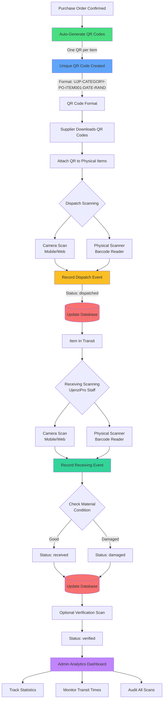

# Comprehensive QR Code System Workflow

## System Overview

The app now automatically generates unique QR codes for **each individual item** when purchased. These QR codes enable dual scanning (dispatch + receiving) with full tracking and admin-only analytics.

## Workflow Diagram



## Key Features

### 1. Automatic QR Generation
- **Trigger**: Purchase order confirmed
- **Unique per item**: Each item gets its own QR code
- **Format**: `UJP-CATEGORY-PONUM-ITEM001-DATE-RAND`
  - Example: `UJP-CEMENT-PO2024001-ITEM001-20250106-4523`
- **Category-based**: First word of material name becomes category
- **Database storage**: All QR codes stored in `material_items` table

### 2. Supplier Workflow
**Download QR Codes**
- Access via Enhanced QR Code Manager
- Download individual QR codes as PNG images
- Bulk download all QR codes for a PO
- Each QR includes: Material name, item number, QR code string

**Attach to Items**
- Print downloaded QR codes
- Physically attach to each material item
- Ensure QR is scannable and visible

**Dispatch Scanning**
- Use Dispatch Scanner component
- Options:
  - Mobile camera scanning
  - Physical QR scanner (USB/Bluetooth)
  - Manual entry
- Record material condition
- Add dispatch notes
- Status changes to "dispatched"

### 3. UjenziPro Staff Workflow
**Receiving Scanning**
- Use Receiving Scanner component
- Scan items as they arrive at building site
- Options:
  - Mobile camera scanning
  - Physical QR scanner
  - Manual entry
- Verify material condition on arrival
- Add receiving notes
- Status changes to "received"

**Optional Verification**
- Final quality check
- Verify quantity matches
- Status changes to "verified"

### 4. Physical Scanner Integration

**Compatible Scanners**
- USB barcode scanners (keyboard wedge mode)
- Bluetooth QR/barcode scanners
- Mobile devices with camera
- Web-based camera scanning

**How to Use Physical Scanner**
1. Connect scanner via USB or Bluetooth
2. Open Dispatch/Receiving Scanner
3. Focus on QR Code input field
4. Scan physical QR code
5. Scanner auto-inputs code
6. Press Enter or click "Record Scan"

**Scanner Types Tracked**
- `mobile_camera`: Phone/tablet camera
- `physical_scanner`: Handheld USB/Bluetooth device
- `web_scanner`: Browser-based scanning

### 5. Admin-Only Analytics

**Access**: Restricted to admin role only

**Scan Statistics Dashboard**
- Total items tracked
- Items by status (pending, dispatched, received, verified, damaged)
- Total scans performed
- Scans by type (dispatch, receiving, verification)
- Average transit time (dispatch to receiving)
- Completion percentage

**Recent Scan Activity**
- Real-time feed of all scans
- QR code scanned
- Scan type (dispatch/receiving/verification)
- Scanner type used
- Material condition
- Timestamp
- Notes from scanner

**Filtering & Reporting**
- Filter by date range
- Filter by supplier
- Export scan data
- Audit trail for compliance

### 6. Data Security

**Row Level Security (RLS)**
- Suppliers: View only their own items
- Builders: View items from their POs
- Admin: Full access to all data
- Scan events: Users insert own scans, only admin views all

**Scan Event Logging**
- Every scan recorded with:
  - User who scanned
  - Device ID
  - Scanner type
  - Timestamp
  - Location (optional)
  - Material condition
  - Notes

### 7. Database Tables

**material_items**
- Stores each individual item with unique QR
- Links to purchase order
- Tracks status through lifecycle
- References scan events

**qr_scan_events**
- Complete audit trail of all scans
- Links to material items
- Captures scanner metadata
- Records conditions and notes

### 8. Status Lifecycle

```
pending → dispatched → received → verified
                          ↓
                       damaged
```

**Status Meanings**
- `pending`: QR generated, awaiting dispatch
- `dispatched`: Supplier scanned, item shipped
- `in_transit`: Optional intermediate status
- `received`: UjenziPro staff scanned at site
- `verified`: Final quality check passed
- `damaged`: Material damaged (flagged during any scan)

## Component Locations

- `src/components/qr/EnhancedQRCodeManager.tsx` - Download QR codes
- `src/components/qr/DispatchScanner.tsx` - Supplier dispatch scanning
- `src/components/qr/ReceivingScanner.tsx` - Site receiving scanning
- `src/components/qr/AdminScanDashboard.tsx` - Admin analytics

## Database Functions

- `auto_generate_item_qr_codes()` - Trigger function for auto-generation
- `record_qr_scan()` - Process and validate scans
- `get_scan_statistics()` - Admin-only statistics aggregation

## Benefits

1. **Accountability**: Every item tracked from supplier to site
2. **Transparency**: Complete audit trail of all movements
3. **Quality Control**: Material condition tracked at each stage
4. **Efficiency**: Physical scanners enable rapid batch processing
5. **Analytics**: Data-driven insights into supply chain
6. **Compliance**: Comprehensive records for auditing
7. **Security**: Admin-only access to sensitive scan data
