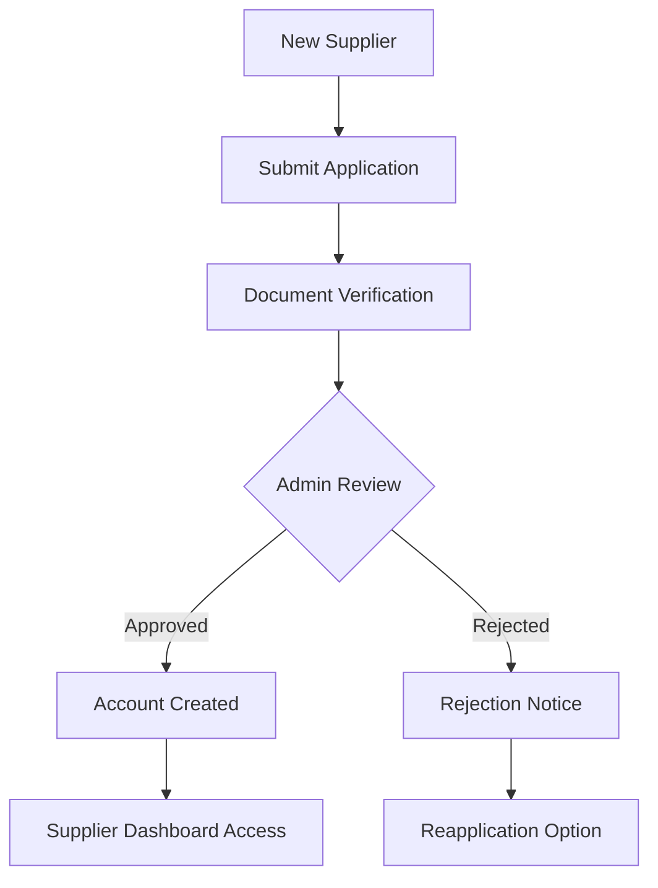

# 🏗️ UjenziPro12 Supplier Workflow System

## 📋 Overview

The UjenziPro12 Supplier Workflow System provides a comprehensive end-to-end solution for suppliers to manage their business operations, from application and onboarding to order fulfillment and performance tracking.

## 🎯 System Components

### **1. Supplier Application Manager** 📝
**File**: `src/components/suppliers/SupplierApplicationManager.tsx`

#### **Features**:
- **Application Submission**: Complete supplier registration form
- **Document Upload**: Business registration and verification documents
- **Status Tracking**: Real-time application status updates
- **Admin Review**: Admin interface for approving/rejecting applications
- **Automated Onboarding**: Automatic account creation upon approval

#### **Workflow**:


#### **Key Functions**:
- Material and specialty selection
- Business information validation
- Kenyan phone number validation
- Email verification
- Admin approval workflow

### **2. Supplier Workflow Dashboard** 📊
**File**: `src/components/suppliers/SupplierWorkflowDashboard.tsx`

#### **Features**:
- **Real-time Statistics**: Orders, revenue, ratings, performance metrics
- **Quick Actions**: Common tasks and shortcuts
- **Order Overview**: Recent orders requiring attention
- **Performance Analytics**: Monthly trends and KPIs
- **Workflow Configuration**: Customizable workflow settings

#### **Dashboard Sections**:
1. **Overview Tab**:
   - Key performance metrics
   - Quick action buttons
   - Recent orders summary
   - Performance indicators

2. **Orders Tab**:
   - Complete order management
   - Status updates and tracking
   - Priority management
   - Bulk operations

3. **Workflow Tab**:
   - Step-by-step order processing
   - Visual workflow progress
   - Time tracking and estimates
   - Process optimization

4. **Analytics Tab**:
   - Performance metrics
   - Trend analysis
   - Customer satisfaction scores
   - Revenue tracking

### **3. Supplier Order Tracker** 📦
**File**: `src/components/suppliers/SupplierOrderTracker.tsx`

#### **Features**:
- **Order Management**: Complete order lifecycle tracking
- **Status Updates**: Real-time order status management
- **Item Tracking**: Individual item-level tracking
- **QR Code Integration**: Generate and manage QR codes for items
- **Delivery Coordination**: Dispatch and delivery management

#### **Order Statuses**:
```
pending → confirmed → processing → ready → dispatched → delivered → completed
```

#### **Tracking Features**:
- **Timeline View**: Complete order history
- **Status Updates**: Manual and automated status changes
- **Location Tracking**: GPS-based delivery tracking
- **Photo Documentation**: Visual proof of delivery
- **Customer Communication**: Automated notifications

### **4. Integration Points** 🔗

#### **Database Integration**:
- **supplier_applications**: Application management
- **suppliers**: Supplier profiles and information
- **orders**: Order management and tracking
- **order_items**: Individual item tracking
- **tracking_updates**: Status change history
- **qr_codes**: QR code management

#### **Security Integration**:
- **Row Level Security (RLS)**: Data access control
- **Role-based Access**: Supplier, admin, builder permissions
- **Audit Logging**: Complete activity tracking
- **Data Encryption**: Sensitive information protection

## 🔄 Complete Supplier Workflow

### **Phase 1: Application & Onboarding** 🚀
1. **Application Submission**:
   - Supplier fills out comprehensive application form
   - Uploads required business documents
   - Selects materials and specialties
   - Provides business registration details

2. **Admin Review**:
   - Admin reviews application and documents
   - Verifies business registration
   - Checks references and credentials
   - Approves or rejects application

3. **Account Creation**:
   - Automatic supplier account creation upon approval
   - Role assignment and permissions setup
   - Welcome email and onboarding materials
   - Dashboard access provisioning

### **Phase 2: Order Management** 📋
1. **Order Reception**:
   - Purchase orders received from builders
   - Automatic order validation and processing
   - Inventory availability checking
   - Order confirmation or rejection

2. **Order Processing**:
   - Item preparation and packaging
   - QR code generation for tracking
   - Quality control and verification
   - Dispatch preparation

3. **Fulfillment**:
   - Order dispatch and delivery
   - Real-time tracking updates
   - Delivery confirmation
   - Customer feedback collection

### **Phase 3: Performance Tracking** 📈
1. **Analytics Dashboard**:
   - Order volume and revenue tracking
   - Customer satisfaction monitoring
   - Delivery performance metrics
   - Quality score tracking

2. **Continuous Improvement**:
   - Performance trend analysis
   - Process optimization recommendations
   - Customer feedback integration
   - Business growth insights

## 🛠️ Technical Implementation

### **Frontend Components**:
```typescript
// Main workflow dashboard
<SupplierWorkflowDashboard />

// Application management
<SupplierApplicationManager />

// Order tracking system
<SupplierOrderTracker />
```

### **Database Schema**:
```sql
-- Supplier applications
CREATE TABLE supplier_applications (
  id UUID PRIMARY KEY,
  applicant_user_id UUID REFERENCES auth.users(id),
  company_name TEXT NOT NULL,
  contact_person TEXT NOT NULL,
  email TEXT NOT NULL,
  phone TEXT NOT NULL,
  status TEXT DEFAULT 'pending',
  -- Additional fields...
);

-- Order tracking
CREATE TABLE orders (
  id UUID PRIMARY KEY,
  supplier_id UUID REFERENCES suppliers(id),
  builder_id UUID REFERENCES profiles(id),
  status TEXT NOT NULL,
  priority TEXT DEFAULT 'medium',
  -- Additional fields...
);

-- Tracking updates
CREATE TABLE tracking_updates (
  id UUID PRIMARY KEY,
  order_id UUID REFERENCES orders(id),
  status TEXT NOT NULL,
  message TEXT,
  timestamp TIMESTAMPTZ DEFAULT NOW(),
  -- Additional fields...
);
```

### **API Integration**:
```typescript
// Order status update
const updateOrderStatus = async (orderId: string, status: string) => {
  const { data, error } = await supabase
    .from('orders')
    .update({ status, updated_at: new Date() })
    .eq('id', orderId);
};

// Application approval
const approveApplication = async (applicationId: string) => {
  const { data, error } = await supabase.rpc('approve_supplier_application', {
    application_id: applicationId
  });
};
```

## 📱 User Experience Flow

### **For New Suppliers**:
1. Visit `/suppliers` page
2. Click "Apply as Supplier"
3. Fill out comprehensive application form
4. Submit application and wait for review
5. Receive approval/rejection notification
6. Access supplier dashboard upon approval

### **For Existing Suppliers**:
1. Login to supplier dashboard
2. View workflow overview and pending orders
3. Process orders through workflow stages
4. Update order statuses and tracking
5. Monitor performance analytics
6. Manage customer communications

### **For Admins**:
1. Access admin panel for supplier management
2. Review and approve/reject applications
3. Monitor supplier performance
4. Manage supplier relationships
5. Generate reports and analytics

## 🔐 Security Features

### **Data Protection**:
- **Encrypted Storage**: All sensitive data encrypted at rest
- **Secure Transmission**: HTTPS/TLS for all communications
- **Access Controls**: Role-based permissions and RLS policies
- **Audit Logging**: Complete activity tracking and monitoring

### **Authentication & Authorization**:
- **Multi-factor Authentication**: Optional MFA for enhanced security
- **Session Management**: Secure session handling and timeout
- **Permission Validation**: Server-side permission checking
- **API Security**: Authenticated and authorized API access

## 📊 Performance Metrics

### **Key Performance Indicators (KPIs)**:
- **Order Fulfillment Rate**: Percentage of orders completed on time
- **Customer Satisfaction**: Average rating from builders
- **Response Time**: Time to confirm and process orders
- **Quality Score**: Product quality and accuracy metrics
- **Revenue Growth**: Monthly and yearly revenue trends

### **Analytics Dashboard**:
- **Real-time Metrics**: Live performance indicators
- **Trend Analysis**: Historical performance trends
- **Comparative Analytics**: Benchmarking against industry standards
- **Predictive Insights**: AI-powered performance predictions

## 🚀 Future Enhancements

### **Planned Features**:
1. **AI-Powered Recommendations**: Intelligent order suggestions
2. **Advanced Analytics**: Machine learning insights
3. **Mobile Application**: Dedicated mobile app for suppliers
4. **Integration APIs**: Third-party system integrations
5. **Automated Workflows**: Smart automation and optimization

### **Scalability Considerations**:
- **Microservices Architecture**: Modular and scalable design
- **Cloud Infrastructure**: Scalable cloud deployment
- **Performance Optimization**: Efficient database queries and caching
- **Load Balancing**: Distributed load handling

## 📞 Support & Documentation

### **User Guides**:
- **Supplier Onboarding Guide**: Step-by-step application process
- **Workflow Management Manual**: Complete workflow documentation
- **API Documentation**: Technical integration guides
- **Troubleshooting Guide**: Common issues and solutions

### **Support Channels**:
- **Help Desk**: 24/7 technical support
- **Training Programs**: Supplier training and certification
- **Community Forum**: Peer-to-peer support and knowledge sharing
- **Documentation Portal**: Comprehensive technical documentation

---

## 🎉 **Workflow System Benefits**

### **For Suppliers**:
- ✅ **Streamlined Operations**: Efficient order management
- ✅ **Increased Visibility**: Real-time performance tracking
- ✅ **Better Customer Relations**: Improved communication and service
- ✅ **Business Growth**: Data-driven insights for expansion

### **For Builders**:
- ✅ **Reliable Supply Chain**: Verified and tracked suppliers
- ✅ **Transparent Tracking**: Real-time order visibility
- ✅ **Quality Assurance**: Verified supplier performance
- ✅ **Efficient Procurement**: Streamlined ordering process

### **For Platform**:
- ✅ **Quality Control**: Verified supplier network
- ✅ **Performance Monitoring**: Complete system visibility
- ✅ **Scalable Growth**: Efficient supplier onboarding
- ✅ **Data Insights**: Comprehensive analytics and reporting

---

**Implementation Status**: ✅ **COMPLETE**  
**Last Updated**: October 8, 2025  
**Version**: 1.0  
**Next Review**: January 2026

