# 🔄 UjenziPro12 Complete Workflow Diagrams

## 📋 Overview

This document provides comprehensive workflow diagrams for all user types and system processes in UjenziPro12, showing the complete user journeys from registration to project completion.

---

## 🏗️ **BUILDER WORKFLOW DIAGRAM**

### **Complete Builder Journey**
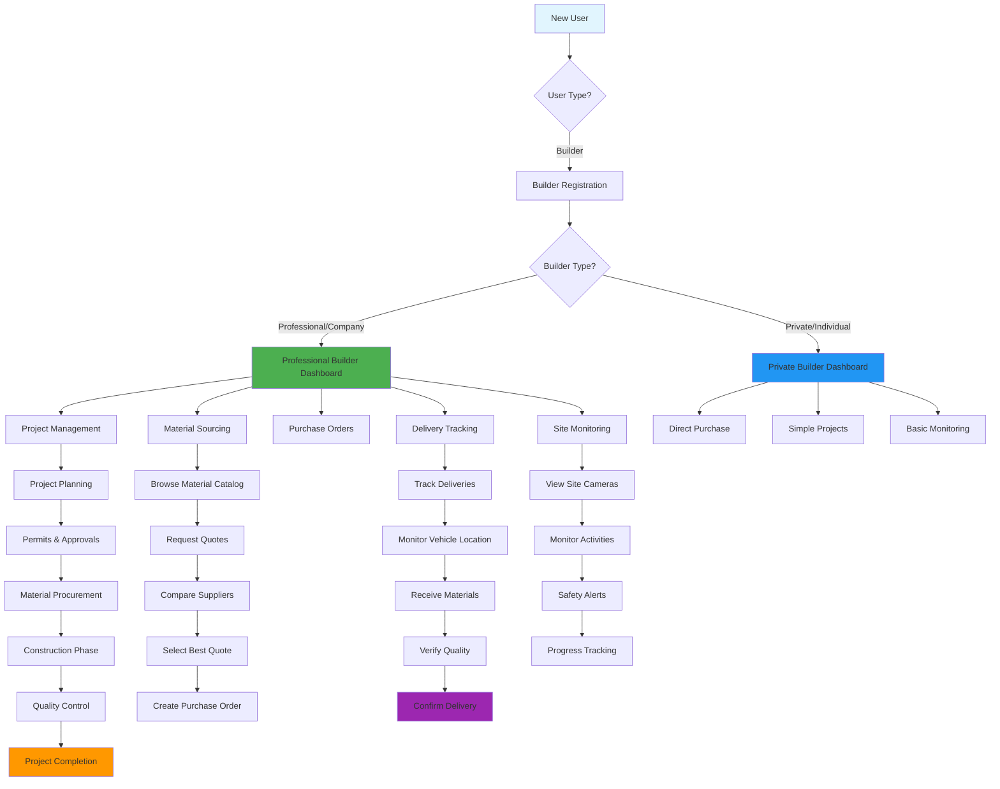

### **Builder Project Workflow (Detailed)**
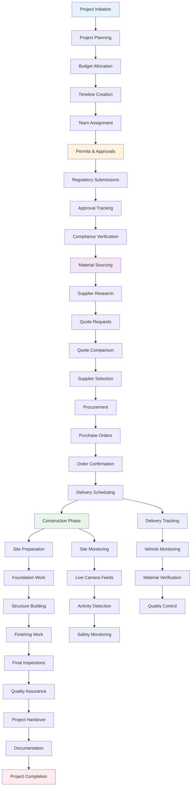

---

## 📦 **SUPPLIER WORKFLOW DIAGRAM**

### **Complete Supplier Journey**
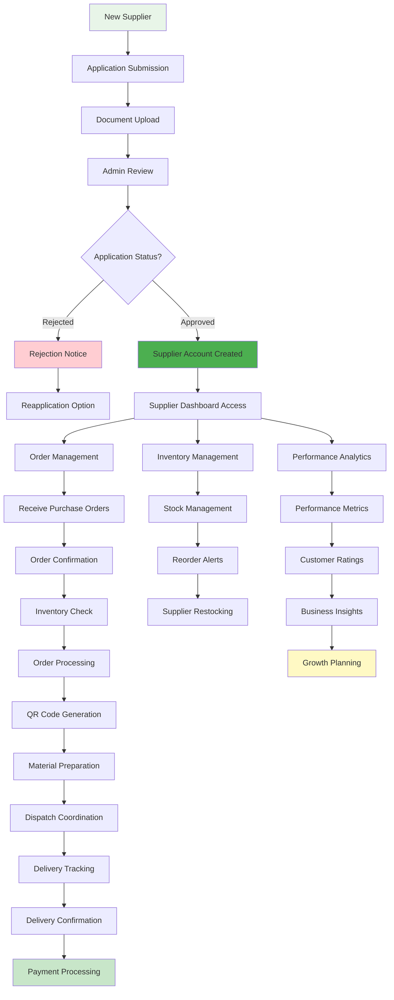

### **Supplier Order Processing Workflow**
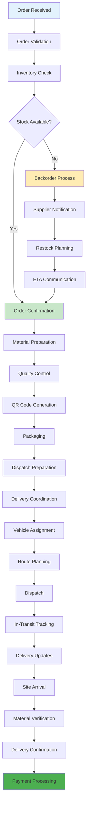

---

## 👨‍💼 **ADMIN WORKFLOW DIAGRAM**

### **Complete Admin System Management**
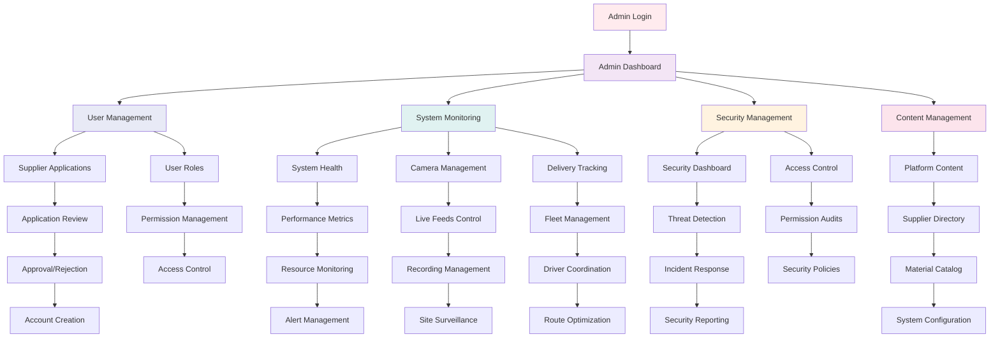

---

## 🚛 **DELIVERY PROVIDER WORKFLOW DIAGRAM**

### **Delivery Provider Journey (Admin-Managed)**
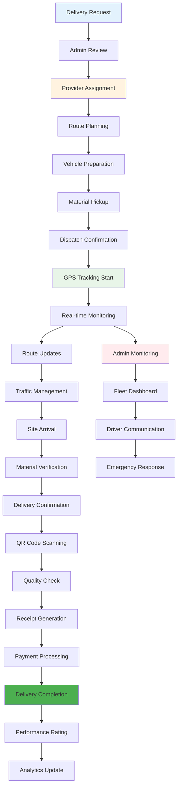

---

## 🔐 **SECURITY WORKFLOW DIAGRAM**

### **Complete Security Architecture**
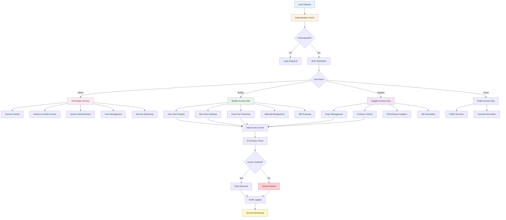

---

## 📊 **MONITORING WORKFLOW DIAGRAM**

### **Complete Monitoring System**
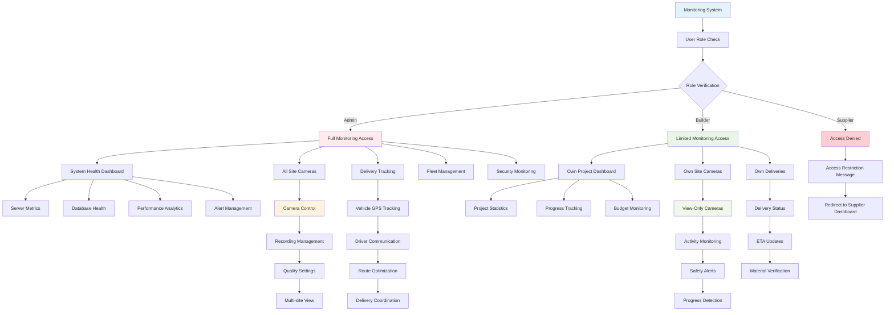

---

## 🔄 **MATERIAL PROCUREMENT WORKFLOW**

### **End-to-End Material Procurement Process**
```mermaid
graph TD
    A[Material Need Identified] --> B[Browse Material Catalog]
    B --> C[Material Selection]
    C --> D[Specification Definition]
    D --> E[Supplier Research]
    
    E --> F[Quote Request Creation]
    F --> G[Send to Multiple Suppliers]
    G --> H[Supplier Notification]
    H --> I[Quote Preparation]
    I --> J[Quote Submission]
    
    J --> K[Quote Comparison]
    K --> L[Price Analysis]
    L --> M[Delivery Time Check]
    M --> N[Quality Assessment]
    N --> O[Supplier Rating Review]
    
    O --> P[Best Quote Selection]
    P --> Q[Purchase Order Creation]
    Q --> R[Order Confirmation]
    R --> S[Payment Terms Agreement]
    
    S --> T[Order Processing]
    T --> U[Inventory Allocation]
    U --> V[QR Code Generation]
    V --> W[Material Preparation]
    W --> X[Quality Control]
    
    X --> Y[Dispatch Preparation]
    Y --> Z[Vehicle Assignment]
    Z --> AA[Route Planning]
    AA --> BB[Delivery Dispatch]
    
    BB --> CC[GPS Tracking]
    CC --> DD[Real-time Updates]
    DD --> EE[Site Arrival]
    EE --> FF[Material Verification]
    FF --> GG[QR Code Scanning]
    GG --> HH[Quality Confirmation]
    HH --> II[Delivery Completion]
    
    II --> JJ[Payment Processing]
    JJ --> KK[Receipt Generation]
    KK --> LL[Performance Rating]
    LL --> MM[Analytics Update]
    
    style A fill:#e3f2fd
    style F fill:#fff3e0
    style P fill:#e8f5e8
    style T fill:#f3e5f5
    style CC fill:#fff9c4
    style II fill:#4caf50
```

---

## 🎯 **USER AUTHENTICATION & AUTHORIZATION FLOW**

### **Security and Access Control Workflow**
```mermaid
graph TD
    A[User Access Request] --> B[Authentication Check]
    B --> C{Authenticated?}
    C -->|No| D[Login Page]
    C -->|Yes| E[Role Verification]
    
    D --> D1[Email/Password]
    D --> D2[OAuth (Google/GitHub)]
    D1 --> D3[Rate Limit Check]
    D2 --> D3
    D3 --> D4{Valid Credentials?}
    D4 -->|No| D5[Failed Attempt Logged]
    D4 -->|Yes| E
    D5 --> D6{Max Attempts?}
    D6 -->|Yes| D7[15-min Lockout]
    D6 -->|No| D1
    
    E --> F[Get User Role]
    F --> G{Role Check}
    G -->|Admin| H[Admin Dashboard]
    G -->|Builder| I[Builder Dashboard]
    G -->|Supplier| J[Supplier Dashboard]
    G -->|Guest| K[Public Access]
    
    H --> H1[Full System Control]
    H1 --> H2[User Management]
    H1 --> H3[Camera Control]
    H1 --> H4[Delivery Provider Access]
    H1 --> H5[System Monitoring]
    
    I --> I1[Project Management]
    I1 --> I2[View Own Cameras]
    I1 --> I3[Track Own Deliveries]
    I1 --> I4[Material Sourcing]
    I1 --> I5[QR Scanning]
    
    J --> J1[Order Management]
    J1 --> J2[Inventory Control]
    J1 --> J3[Performance Analytics]
    J1 --> J4[QR Generation]
    
    K --> K1[Public Directory]
    K1 --> K2[General Information]
    
    I2 --> L[Access Validation]
    I3 --> L
    H3 --> L
    H4 --> L
    
    L --> M[RLS Policy Check]
    M --> N{Permission Granted?}
    N -->|Yes| O[Data Access]
    N -->|No| P[Access Denied]
    
    O --> Q[Audit Logging]
    P --> Q
    Q --> R[Security Monitoring]
    
    style A fill:#e3f2fd
    style D fill:#fff3e0
    style H fill:#ffebee
    style I fill:#e8f5e8
    style J fill:#f3e5f5
    style P fill:#ffcdd2
    style R fill:#fff9c4
```

---

## 📱 **QR CODE SYSTEM WORKFLOW**

### **Complete QR Code Lifecycle**
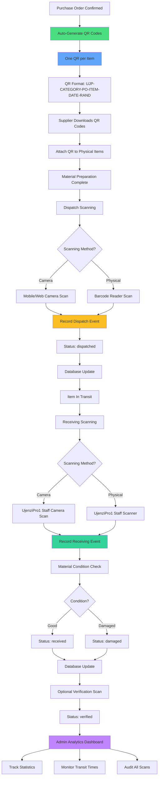

---

## 🔍 **MONITORING SYSTEM WORKFLOW**

### **Real-time Monitoring Architecture**
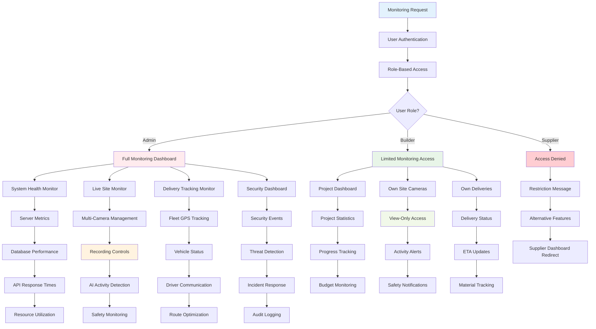

---

## 🏢 **COMPLETE SYSTEM ARCHITECTURE WORKFLOW**

### **High-Level System Integration**
```mermaid
graph TD
    A[UjenziPro12 Platform] --> B[Frontend React App]
    A --> C[Supabase Backend]
    A --> D[Security Layer]
    A --> E[Monitoring System]
    
    B --> B1[Builder Interface]
    B --> B2[Supplier Interface]
    B --> B3[Admin Interface]
    B --> B4[Public Interface]
    
    B1 --> B1A[Project Management]
    B1 --> B1B[Material Sourcing]
    B1 --> B1C[Delivery Tracking]
    B1 --> B1D[Site Monitoring]
    
    B2 --> B2A[Order Management]
    B2 --> B2B[Inventory Control]
    B2 --> B2C[Performance Analytics]
    
    B3 --> B3A[User Management]
    B3 --> B3B[System Control]
    B3 --> B3C[Security Management]
    B3 --> B3D[Content Management]
    
    C --> C1[PostgreSQL Database]
    C --> C2[Edge Functions]
    C --> C3[Authentication]
    C --> C4[Storage]
    
    C1 --> C1A[RLS Policies]
    C1 --> C1B[Data Encryption]
    C1 --> C1C[Audit Logging]
    
    C2 --> C2A[Secure APIs]
    C2 --> C2B[Business Logic]
    C2 --> C2C[Data Processing]
    
    D --> D1[Authentication]
    D --> D2[Authorization]
    D --> D3[Data Protection]
    D --> D4[Monitoring]
    
    D1 --> D1A[JWT Tokens]
    D1 --> D1B[Rate Limiting]
    D1 --> D1C[Session Management]
    
    D2 --> D2A[Role-Based Access]
    D2 --> D2B[Permission Checks]
    D2 --> D2C[Resource Isolation]
    
    D3 --> D3A[Field Encryption]
    D3 --> D3B[Data Masking]
    D3 --> D3C[Privacy Controls]
    
    E --> E1[Live Cameras]
    E --> E2[GPS Tracking]
    E --> E3[System Health]
    E --> E4[Security Events]
    
    E1 --> E1A[AI Detection]
    E1 --> E1B[Safety Monitoring]
    E1 --> E1C[Progress Tracking]
    
    E2 --> E2A[Vehicle Monitoring]
    E2 --> E2B[Route Tracking]
    E2 --> E2C[Driver Communication]
    
    style A fill:#e3f2fd
    style B fill:#e8f5e8
    style C fill:#fff3e0
    style D fill:#ffebee
    style E fill:#f3e5f5
```

---

## 📈 **DATA FLOW DIAGRAM**

### **Complete Data Flow Architecture**
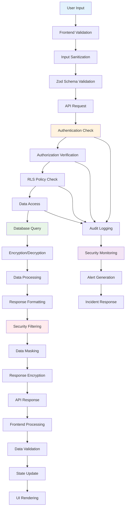

---

## 🚨 **INCIDENT RESPONSE WORKFLOW**

### **Security Incident Response Process**
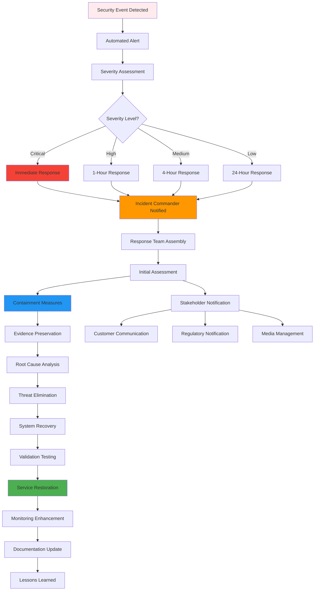

---

## 📊 **ANALYTICS & REPORTING WORKFLOW**

### **Business Intelligence and Analytics Process**
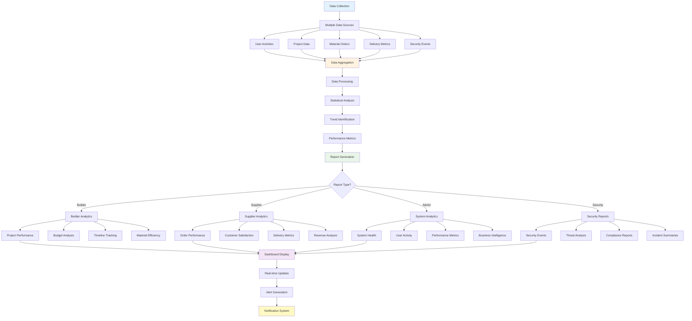

---

## 🔄 **COMPLETE USER JOURNEY MAP**

### **End-to-End User Experience**
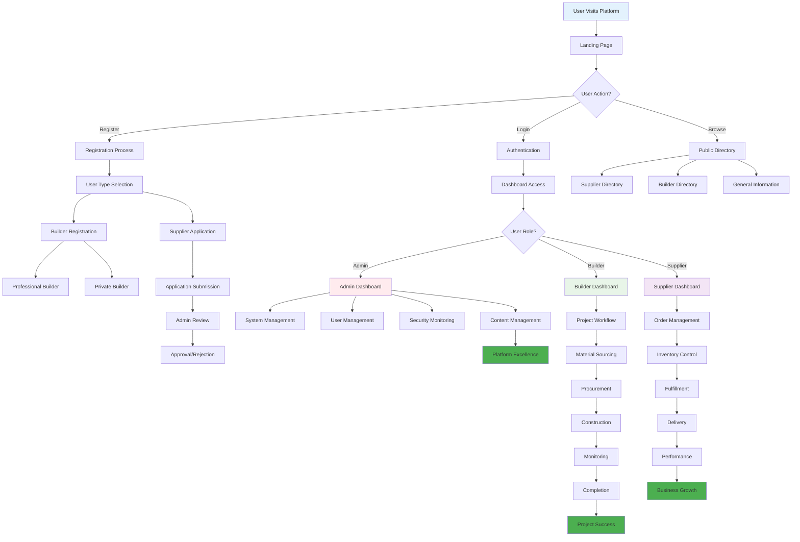

---

## 🎯 **WORKFLOW SUMMARY**

### **🏗️ Builder Workflow**:
**Planning → Sourcing → Procurement → Construction → Monitoring → Completion**

### **📦 Supplier Workflow**:
**Application → Approval → Orders → Processing → Delivery → Analytics**

### **👨‍💼 Admin Workflow**:
**Management → Monitoring → Security → Control → Optimization**

### **🔐 Security Workflow**:
**Authentication → Authorization → Access Control → Audit → Monitoring**

### **📊 Monitoring Workflow**:
**Detection → Analysis → Response → Resolution → Improvement**

---

## 🎉 **Workflow System Benefits**

### **🎯 For Users**:
- **Clear Process Flow**: Intuitive step-by-step workflows
- **Role-Appropriate Access**: Customized experience for each user type
- **Real-time Updates**: Live status tracking and notifications
- **Security Assurance**: Protected data and secure operations

### **🏢 For Business**:
- **Operational Efficiency**: Streamlined processes and automation
- **Quality Control**: Comprehensive monitoring and verification
- **Risk Management**: Proactive issue detection and resolution
- **Scalable Growth**: Architecture supports business expansion

### **🛡️ For Security**:
- **Access Control**: Proper role-based access restrictions
- **Data Protection**: Multi-layer security and encryption
- **Audit Trail**: Complete activity logging and monitoring
- **Incident Response**: Rapid response to security events

---

**These workflow diagrams provide a complete visual representation of how UjenziPro12 operates, showing the sophisticated yet user-friendly processes that make it a world-class construction platform!** 🏆

**Diagram Version**: 1.0  
**Last Updated**: October 8, 2025  
**Coverage**: Complete system workflows  
**Status**: ✅ **COMPREHENSIVE**

