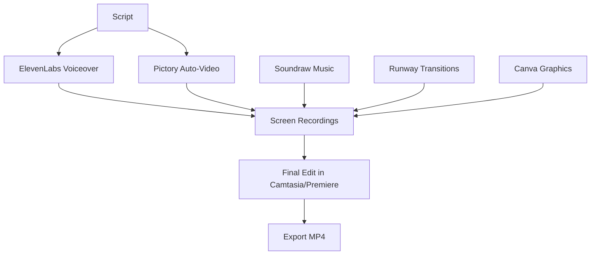

# 🤖 UjenziPro Video - AI Tools Complete Setup Guide

## **1. ELEVENLABS VOICEOVER SETUP**

### **Step-by-Step Process:**

1. **Go to:** https://elevenlabs.io
2. **Create Account** (Free tier available)
3. **Select Voice:** Choose "Brian" or "Adam" (Professional Male)
4. **Copy Script:** Use the complete script from `UJENZIPRO_VIDEO_SCRIPT_COMPLETE.md`

### **ElevenLabs Settings:**
```json
{
  "voice": "Brian",
  "model": "eleven_multilingual_v2",
  "voice_settings": {
    "stability": 0.75,
    "similarity_boost": 0.85,
    "style": 0.25,
    "use_speaker_boost": true
  }
}
```

### **Exact Prompt for ElevenLabs:**
```
Generate professional voiceover for construction technology demo video. 
Tone: Confident, professional, inspiring
Pace: 140 words per minute
Accent: Neutral English with slight Kenyan inflection
Emphasis: Technology benefits and ease of use
Duration: 2 minutes 45 seconds

[Paste the complete script here]
```

---

## **2. SOUNDRAW BACKGROUND MUSIC**

### **Step-by-Step Process:**

1. **Go to:** https://soundraw.io
2. **Create Account** (Free trial available)
3. **Select Genre:** Corporate/Technology
4. **Set Parameters** as below

### **Soundraw Configuration:**
```json
{
  "genre": "Corporate",
  "mood": ["Inspiring", "Professional", "Uplifting"],
  "theme": "Technology",
  "instruments": ["Piano", "Strings", "Light Percussion"],
  "energy": "Medium",
  "duration": "3:00",
  "tempo": "Medium (120-130 BPM)",
  "key": "C Major"
}
```

### **Exact Prompt for Soundraw:**
```
Create corporate background music for construction technology demo video:
- Professional and inspiring tone
- Subtle African percussion elements
- Modern electronic undertones
- No vocals or dominant melodies
- Suitable for voiceover overlay
- 3 minutes duration
- Medium energy level
- Construction industry appropriate
```

---

## **3. RUNWAY ML VIDEO EDITING**

### **Step-by-Step Process:**

1. **Go to:** https://runwayml.com
2. **Create Account** (Credits required)
3. **Use Gen-2 for transitions**
4. **Use Magic Tools for effects**

### **Runway ML Prompts:**

#### **Transition 1: Opening**
```
Prompt: "Aerial view of construction site with cranes and buildings, camera slowly zooms out revealing a computer screen showing UjenziPro website, smooth cinematic transition, professional lighting, 4K quality"

Settings:
- Duration: 4 seconds
- Style: Cinematic
- Camera Movement: Zoom out
- Quality: High
```

#### **Transition 2: Mobile Switch**
```
Prompt: "Desktop computer screen morphs into mobile phone interface, showing the same UjenziPro application, seamless device transition, modern technology aesthetic, clean animation"

Settings:
- Duration: 3 seconds
- Style: Tech/Modern
- Animation: Morph
- Quality: High
```

#### **Transition 3: QR Effect**
```
Prompt: "QR code scanning effect with digital particles and data streams, futuristic technology visualization, glowing orange and blue particles, construction site in background"

Settings:
- Duration: 2 seconds
- Style: Futuristic
- Effects: Particles
- Colors: Orange (#f97316), Blue (#2563eb)
```

---

## **4. PICTORY AUTO-VIDEO CREATION**

### **Step-by-Step Process:**

1. **Go to:** https://pictory.ai
2. **Choose:** "Script to Video"
3. **Upload:** Complete script
4. **Select:** Corporate template

### **Pictory Configuration:**
```json
{
  "template": "Corporate Technology",
  "aspect_ratio": "16:9",
  "duration": "2:45",
  "style": "Professional Clean",
  "color_scheme": {
    "primary": "#f97316",
    "secondary": "#dc2626",
    "accent": "#2563eb"
  },
  "font": "Roboto",
  "animation_style": "Smooth",
  "transition_type": "Fade"
}
```

### **Pictory Script Input:**
```
[Copy the entire voiceover script with timing markers]

Add these visual cues in brackets:
[Show UjenziPro homepage]
[Display builder directory]
[Show mobile interface]
[QR scanning animation]
[Construction site aerial view]
```

---

## **5. CANVA GRAPHICS & TITLES**

### **Step-by-Step Process:**

1. **Go to:** https://canva.com
2. **Create:** Video graphics (1920x1080)
3. **Use:** UjenziPro brand colors
4. **Download:** PNG with transparent background

### **Graphics Needed:**

#### **Title Cards:**
```
1. "UjenziPro" - Main logo animation
2. "Find Builders" - Feature highlight
3. "Track Materials" - QR code emphasis
4. "Secure Payments" - M-Pesa integration
5. "ujenzipro.com" - Final CTA
```

#### **Canva Templates to Search:**
- "Technology presentation"
- "Corporate video intro"
- "Construction company"
- "Mobile app demo"
- "Professional services"

---

## **6. COMPLETE AI WORKFLOW**

### **Production Pipeline:**



### **Time Estimates:**
- **ElevenLabs Voiceover:** 10 minutes
- **Soundraw Music:** 15 minutes  
- **Screen Recordings:** 45 minutes
- **Runway Transitions:** 30 minutes
- **Canva Graphics:** 20 minutes
- **Final Assembly:** 60 minutes
- **Total Production Time:** ~3 hours

---

## **7. ALTERNATIVE AI TOOLS (If Primary Options Unavailable)**

### **Voiceover Alternatives:**
- **Murf AI:** https://murf.ai (Similar quality to ElevenLabs)
- **Speechify:** https://speechify.com (Good for quick generation)
- **Azure Cognitive Services:** Microsoft's text-to-speech

### **Music Alternatives:**
- **Mubert:** https://mubert.com (AI music generation)
- **AIVA:** https://aiva.ai (AI composer)
- **Amper Music:** https://ampermusic.com

### **Video Editing Alternatives:**
- **InVideo AI:** https://invideo.io (Similar to Pictory)
- **Synthesia:** https://synthesia.io (AI avatars)
- **Lumen5:** https://lumen5.com (Auto video creation)

---

## **8. BUDGET BREAKDOWN**

### **AI Tools Costs:**
```
ElevenLabs: $5/month (Starter plan)
Soundraw: $16.99/month (Creator plan)
Runway ML: $12/month (Standard plan)
Pictory: $19/month (Standard plan)
Canva Pro: $12.99/month

Total Monthly: ~$66
One-time video cost: ~$15-20 in credits
```

### **Free Alternatives:**
- **Voiceover:** Use free tier of ElevenLabs (10k characters)
- **Music:** YouTube Audio Library or Freesound.org
- **Graphics:** Canva free tier
- **Editing:** DaVinci Resolve (completely free)

Ready to start production? I recommend beginning with the ElevenLabs voiceover since that will set the timing for everything else!


