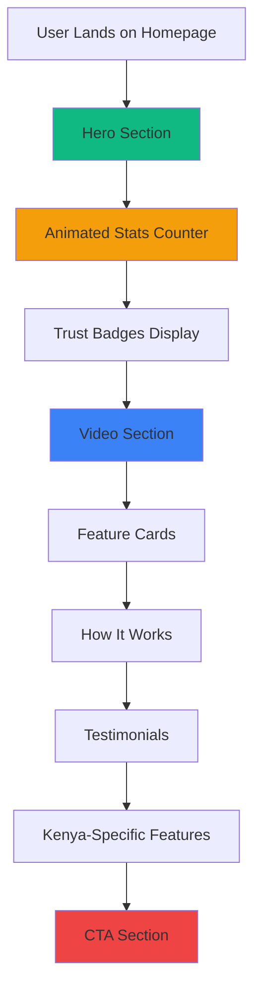
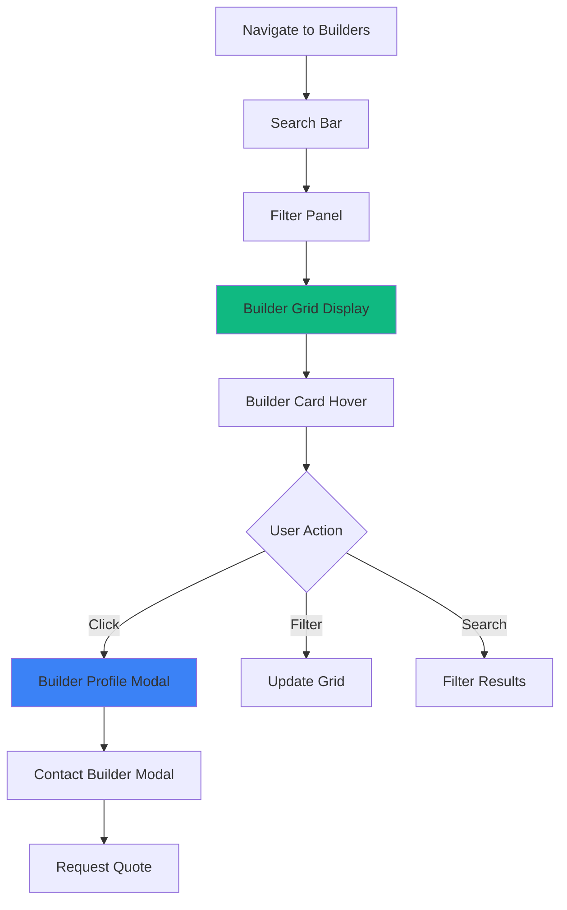
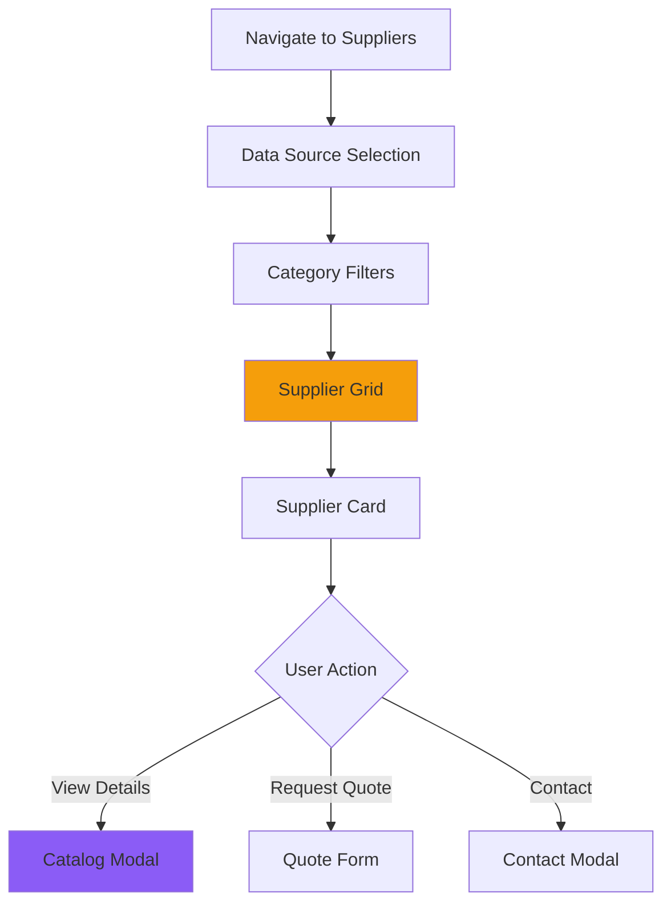
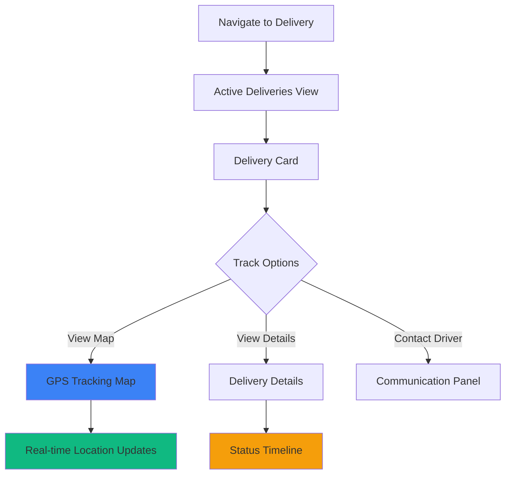
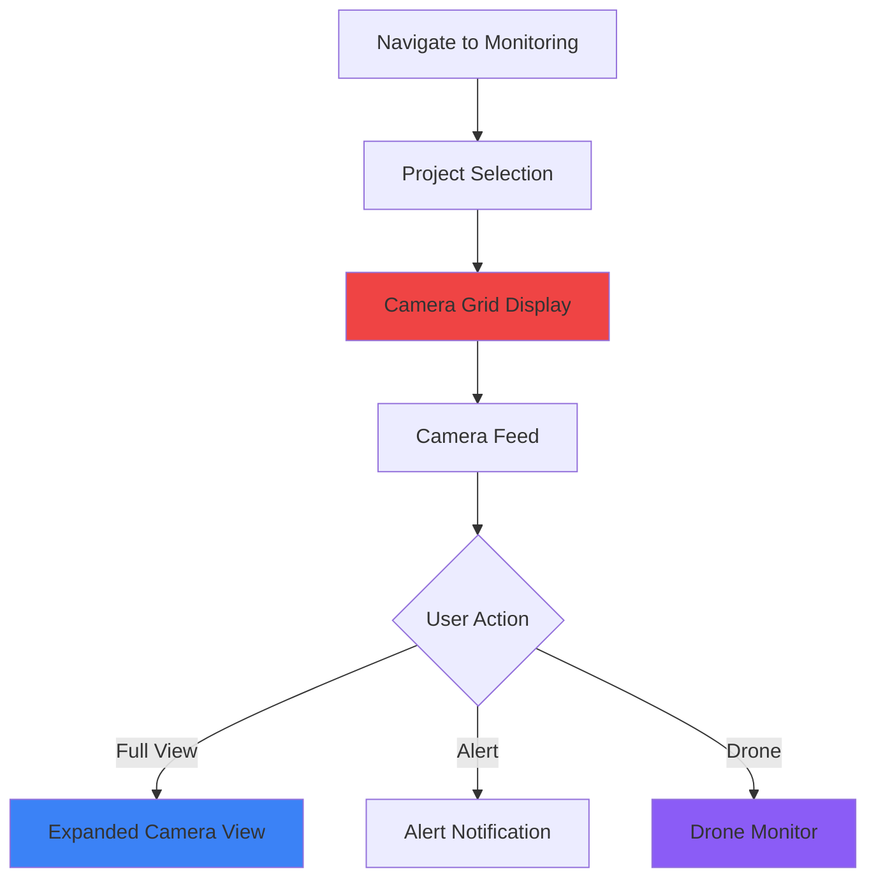
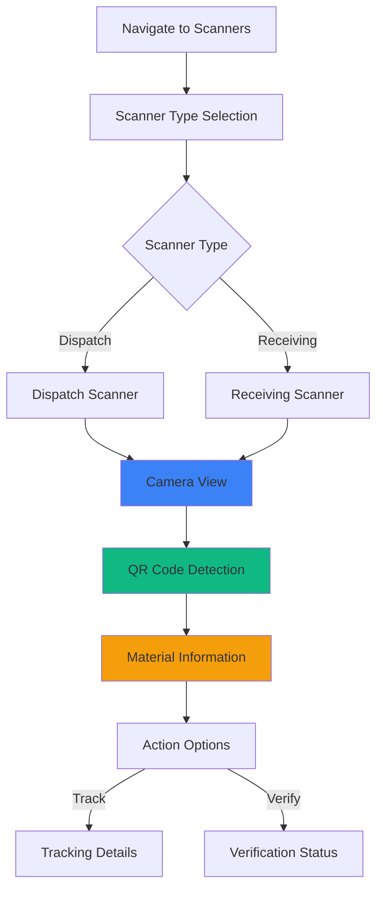

# 🎨 UjenziPro App Process & Animation Guide

## 📋 Table of Contents
1. [Application Architecture](#application-architecture)
2. [User Journey Flow](#user-journey-flow)
3. [Existing Animation System](#existing-animation-system)
4. [Animation Opportunities](#animation-opportunities)
5. [Implementation Strategies](#implementation-strategies)
6. [Performance Optimization](#performance-optimization)

---

## 🏗️ Application Architecture

### **Tech Stack**
```
Frontend:
├── React 18 (Functional Components + Hooks)
├── TypeScript (Type-safe Development)
├── Tailwind CSS (Utility-first Styling)
├── shadcn/ui (Component Library)
├── Vite (Build Tool)
└── React Router (Navigation)

Backend:
├── Supabase (PostgreSQL Database)
├── Row Level Security (RLS)
├── Real-time Subscriptions
└── Edge Functions

Animation Libraries (Current):
├── Custom useScrollAnimation Hook
├── CSS Transitions
└── Tailwind CSS Animations
```

### **Core Pages Structure**
```
UjenziPro2/
├── Homepage (/)                    → Landing page with hero, features
├── Builders (/builders)            → Builder directory & profiles
├── Suppliers (/suppliers)          → Supplier network & catalog
├── Delivery (/delivery)            → Delivery tracking & management
├── Monitoring (/monitoring)        → Live site monitoring (view-only)
├── Scanners (/scanners)            → QR code scanning & verification
├── Tracking (/tracking)            → Material tracking system
├── Feedback (/feedback)            → User feedback & reviews
├── Contact (/contact)              → Contact form
└── About (/about)                  → About UjenziPro
```

---

## 🚀 User Journey Flow

### **1. HOMEPAGE FLOW**


**Current Animations:**
- ✅ **AnimatedSection**: Fade-in on scroll for sections
- ✅ **AnimatedCounter**: Number counting animation
- ✅ **Hover Effects**: Scale & shadow transitions
- ✅ **Background**: Optimized background images

**Animation Opportunities:**
- 🎯 Hero text slide-in sequence
- 🎯 Floating icons/badges animation
- 🎯 Parallax scrolling effects
- 🎯 Staggered feature card reveals
- 🎯 Video thumbnail pulse effect

---

### **2. BUILDERS PAGE FLOW**


**Current Features:**
- Builder search with filters
- Grid layout with cards
- Profile modals
- Contact forms
- Review system

**Animation Opportunities:**
- 🎯 Search bar focus animation
- 🎯 Filter slide-in drawer
- 🎯 Card grid stagger animation
- 🎯 Profile modal slide-up
- 🎯 Rating stars animation
- 🎯 Success message celebration
- 🎯 Loading skeleton screens

---

### **3. SUPPLIERS PAGE FLOW**


**Current Features:**
- Multiple data sources (Supabase, Mock, Test)
- Category filtering
- Product catalogs
- Quote requests
- Review system

**Animation Opportunities:**
- 🎯 Data source toggle transition
- 🎯 Category tab slide animation
- 🎯 Product card flip effect
- 🎯 Quote form slide-in
- 🎯 Success confetti animation
- 🎯 Inventory badge pulse

---

### **4. DELIVERY TRACKING FLOW**


**Current Features:**
- GPS tracking
- Provider directory
- Delivery status updates
- Cost calculator
- Real-time notifications

**Animation Opportunities:**
- 🎯 Moving vehicle marker on map
- 🎯 Route line drawing animation
- 🎯 Status timeline progress bar
- 🎯 ETA countdown animation
- 🎯 Delivery completion celebration
- 🎯 Distance calculation loader

---

### **5. MONITORING DASHBOARD FLOW**


**Current Features:**
- Multi-camera grid
- Live stream feeds
- Alert system
- Drone monitoring
- Access control (view-only for builders)

**Animation Opportunities:**
- 🎯 Camera feed fade-in transitions
- 🎯 Grid layout animations
- 🎯 Alert pulse/bounce effect
- 🎯 Recording indicator blink
- 🎯 Drone flight path animation
- 🎯 Live indicator pulse

---

### **6. QR SCANNER FLOW**


**Current Features:**
- QR code generation
- Material scanning
- Dispatch/receiving workflow
- Bulk scanning
- Offline support

**Animation Opportunities:**
- 🎯 Scanner viewfinder animation
- 🎯 QR detection highlight
- 🎯 Scan success checkmark
- 🎯 Material card slide-up
- 🎯 Verification badge animation
- 🎯 Scanning beam effect

---

## 🎬 Existing Animation System

### **Current Animation Components**

#### **1. AnimatedSection Component**
**Location:** `src/components/AnimatedSection.tsx`

**Features:**
- Scroll-triggered animations
- Multiple animation types:
  - `fadeInUp` - Fade in from bottom
  - `fadeInLeft` - Fade in from left
  - `fadeInRight` - Fade in from right
  - `fadeIn` - Simple fade
  - `scaleIn` - Scale up animation
- Configurable delay
- Intersection Observer based

**Usage Example:**
```tsx
<AnimatedSection animation="fadeInUp" delay={100}>
  <Card>Your Content</Card>
</AnimatedSection>
```

---

#### **2. AnimatedCounter Component**
**Location:** `src/components/AnimatedCounter.tsx`

**Features:**
- Number counting animation
- Scroll-triggered
- Customizable duration
- Supports suffixes (e.g., "+", "K")
- Locale-aware formatting

**Usage Example:**
```tsx
<AnimatedCounter 
  end={2500} 
  suffix="+" 
  duration={2000} 
/>
```

---

#### **3. useScrollAnimation Hook**
**Location:** `src/hooks/useScrollAnimation.ts`

**Features:**
- Intersection Observer wrapper
- Configurable threshold
- Returns visibility state and ref
- Includes useCountUp functionality

**Usage Example:**
```tsx
const { ref, isVisible } = useScrollAnimation({ threshold: 0.1 });
```

---

## 🎨 Animation Opportunities by Priority

### **🔥 HIGH PRIORITY (Immediate Impact)**

#### **1. Page Transition Animations**
**Impact:** Professional feel, smooth navigation
**Effort:** Medium
**Implementation:**
```tsx
// Add to App.tsx with framer-motion
import { AnimatePresence, motion } from "framer-motion";

<AnimatePresence mode="wait">
  <motion.div
    key={location.pathname}
    initial={{ opacity: 0, y: 20 }}
    animate={{ opacity: 1, y: 0 }}
    exit={{ opacity: 0, y: -20 }}
    transition={{ duration: 0.3 }}
  >
    <Routes location={location}>
      {/* Your routes */}
    </Routes>
  </motion.div>
</AnimatePresence>
```

---

#### **2. Loading States & Skeletons**
**Impact:** Better perceived performance
**Effort:** Low-Medium
**Components Needed:**
- Card skeleton loaders
- Table skeleton loaders
- Image lazy loading placeholders
- Progress indicators

**Implementation:**
```tsx
// Create LoadingSkeleton.tsx
export const CardSkeleton = () => (
  <div className="animate-pulse space-y-4">
    <div className="h-4 bg-gray-200 rounded w-3/4"></div>
    <div className="h-4 bg-gray-200 rounded"></div>
    <div className="h-4 bg-gray-200 rounded w-5/6"></div>
  </div>
);
```

---

#### **3. Form Validation Animations**
**Impact:** Clear user feedback
**Effort:** Low
**Implementation:**
```tsx
// Add shake animation for errors
const shakeAnimation = {
  0: { transform: 'translateX(0)' },
  25: { transform: 'translateX(-10px)' },
  50: { transform: 'translateX(10px)' },
  75: { transform: 'translateX(-10px)' },
  100: { transform: 'translateX(0)' }
};

// In tailwind.config.ts
animation: {
  shake: 'shake 0.5s ease-in-out'
}
```

---

#### **4. Success/Error Toast Animations**
**Impact:** Clear feedback on actions
**Effort:** Low (already using sonner)
**Enhancement:**
```tsx
import { toast } from "sonner";

// Success with custom animation
toast.success("Builder added!", {
  duration: 3000,
  className: "animate-bounce-in"
});

// Error with shake
toast.error("Failed to submit", {
  className: "animate-shake"
});
```

---

### **⚡ MEDIUM PRIORITY (Enhanced UX)**

#### **5. Micro-interactions**
**Impact:** Polished, professional feel
**Effort:** Low-Medium

**Examples:**
- Button press animations (scale down)
- Icon hover rotations
- Badge pulse effects
- Star rating animations
- Toggle switch animations

**Implementation:**
```tsx
// Add to Button component
<Button className="
  transition-all 
  duration-200 
  active:scale-95 
  hover:shadow-lg
  hover:-translate-y-0.5
">
  Click Me
</Button>
```

---

#### **6. Staggered List Animations**
**Impact:** Professional card/list reveals
**Effort:** Medium

**For Builder/Supplier Grids:**
```tsx
import { motion } from "framer-motion";

const container = {
  hidden: { opacity: 0 },
  show: {
    opacity: 1,
    transition: {
      staggerChildren: 0.1
    }
  }
};

const item = {
  hidden: { opacity: 0, y: 20 },
  show: { opacity: 1, y: 0 }
};

<motion.div variants={container} initial="hidden" animate="show">
  {builders.map(builder => (
    <motion.div key={builder.id} variants={item}>
      <BuilderCard builder={builder} />
    </motion.div>
  ))}
</motion.div>
```

---

#### **7. Modal/Dialog Animations**
**Impact:** Smooth transitions
**Effort:** Low-Medium

**Implementation:**
```tsx
// Enhance existing modals
<Dialog>
  <DialogContent className="
    animate-in 
    fade-in-0 
    zoom-in-95 
    slide-in-from-bottom-2
  ">
    {/* Content */}
  </DialogContent>
</Dialog>
```

---

#### **8. Progress Indicators**
**Impact:** Clear process visualization
**Effort:** Medium

**For Multi-step Forms:**
```tsx
// Progress bar component
export const ProgressSteps = ({ currentStep, totalSteps }) => (
  <div className="flex gap-2">
    {Array.from({ length: totalSteps }).map((_, i) => (
      <motion.div
        key={i}
        className={`h-2 flex-1 rounded-full ${
          i <= currentStep ? 'bg-primary' : 'bg-gray-200'
        }`}
        initial={{ scaleX: 0 }}
        animate={{ scaleX: i <= currentStep ? 1 : 0.3 }}
        transition={{ duration: 0.3 }}
      />
    ))}
  </div>
);
```

---

### **🌟 LOW PRIORITY (Polish & Delight)**

#### **9. Parallax Effects**
**Impact:** Modern, engaging feel
**Effort:** Medium-High

**For Homepage:**
```tsx
import { useScroll, useTransform, motion } from "framer-motion";

const HeroSection = () => {
  const { scrollY } = useScroll();
  const y = useTransform(scrollY, [0, 500], [0, 150]);

  return (
    <motion.div style={{ y }}>
      {/* Hero content */}
    </motion.div>
  );
};
```

---

#### **10. Confetti/Celebration Animations**
**Impact:** Delightful user feedback
**Effort:** Low (using library)

**For Success Actions:**
```tsx
import confetti from 'canvas-confetti';

// On successful quote submission
const handleSuccess = () => {
  confetti({
    particleCount: 100,
    spread: 70,
    origin: { y: 0.6 }
  });
  toast.success("Quote submitted!");
};
```

---

#### **11. Typing/Loading Animations**
**Impact:** Engaging waiting states
**Effort:** Low-Medium

**For AI Features:**
```tsx
export const TypingIndicator = () => (
  <div className="flex space-x-2 p-3">
    <div className="w-2 h-2 bg-gray-400 rounded-full animate-bounce [animation-delay:-0.3s]"></div>
    <div className="w-2 h-2 bg-gray-400 rounded-full animate-bounce [animation-delay:-0.15s]"></div>
    <div className="w-2 h-2 bg-gray-400 rounded-full animate-bounce"></div>
  </div>
);
```

---

#### **12. Chart/Data Animations**
**Impact:** Engaging data visualization
**Effort:** Medium (recharts already supports)

**For Analytics Dashboards:**
```tsx
import { LineChart, Line } from 'recharts';

<LineChart>
  <Line
    type="monotone"
    dataKey="value"
    stroke="#8884d8"
    animationDuration={1000}
    animationEasing="ease-in-out"
  />
</LineChart>
```

---

## 🛠️ Implementation Strategies

### **Option 1: Framer Motion (Recommended)**

**Pros:**
- ✅ Most powerful React animation library
- ✅ Great TypeScript support
- ✅ Gesture support (drag, tap, hover)
- ✅ Layout animations
- ✅ SVG animation support

**Installation:**
```bash
npm install framer-motion
```

**Basic Setup:**
```tsx
import { motion } from "framer-motion";

export const AnimatedCard = ({ children }) => (
  <motion.div
    initial={{ opacity: 0, y: 20 }}
    animate={{ opacity: 1, y: 0 }}
    exit={{ opacity: 0, y: -20 }}
    whileHover={{ scale: 1.05 }}
    whileTap={{ scale: 0.95 }}
  >
    {children}
  </motion.div>
);
```

---

### **Option 2: React Spring**

**Pros:**
- ✅ Physics-based animations
- ✅ Great performance
- ✅ Spring animations feel natural

**Installation:**
```bash
npm install @react-spring/web
```

**Example:**
```tsx
import { useSpring, animated } from '@react-spring/web';

const AnimatedComponent = () => {
  const props = useSpring({
    from: { opacity: 0 },
    to: { opacity: 1 }
  });

  return <animated.div style={props}>Content</animated.div>;
};
```

---

### **Option 3: CSS Animations + Tailwind**

**Pros:**
- ✅ Already in project
- ✅ Zero additional dependencies
- ✅ Great for simple animations
- ✅ Best performance

**Custom Animations in tailwind.config.ts:**
```typescript
module.exports = {
  theme: {
    extend: {
      animation: {
        'fade-in': 'fadeIn 0.5s ease-in-out',
        'slide-up': 'slideUp 0.3s ease-out',
        'slide-down': 'slideDown 0.3s ease-out',
        'bounce-in': 'bounceIn 0.5s ease-out',
        'shake': 'shake 0.5s ease-in-out',
        'pulse-slow': 'pulse 3s cubic-bezier(0.4, 0, 0.6, 1) infinite',
      },
      keyframes: {
        fadeIn: {
          '0%': { opacity: '0' },
          '100%': { opacity: '1' },
        },
        slideUp: {
          '0%': { transform: 'translateY(20px)', opacity: '0' },
          '100%': { transform: 'translateY(0)', opacity: '1' },
        },
        slideDown: {
          '0%': { transform: 'translateY(-20px)', opacity: '0' },
          '100%': { transform: 'translateY(0)', opacity: '1' },
        },
        bounceIn: {
          '0%': { transform: 'scale(0.3)', opacity: '0' },
          '50%': { transform: 'scale(1.05)' },
          '70%': { transform: 'scale(0.9)' },
          '100%': { transform: 'scale(1)', opacity: '1' },
        },
        shake: {
          '0%, 100%': { transform: 'translateX(0)' },
          '10%, 30%, 50%, 70%, 90%': { transform: 'translateX(-10px)' },
          '20%, 40%, 60%, 80%': { transform: 'translateX(10px)' },
        },
      },
    },
  },
};
```

---

## 📊 Performance Optimization

### **Best Practices for Animations**

#### **1. Use CSS Transforms (GPU Accelerated)**
✅ **Good:**
```css
transform: translateX(100px);
transform: scale(1.1);
opacity: 0.5;
```

❌ **Bad:**
```css
left: 100px;
width: 200px;
margin-left: 50px;
```

---

#### **2. Reduce Animation Complexity**
- Keep animations under 300-400ms for interactions
- Use `will-change` sparingly
- Prefer `opacity` and `transform` properties
- Avoid animating `box-shadow` (heavy)

---

#### **3. Lazy Load Animations**
```tsx
import { lazy, Suspense } from 'react';

const HeavyAnimatedComponent = lazy(() => 
  import('./components/HeavyAnimatedComponent')
);

<Suspense fallback={<Skeleton />}>
  <HeavyAnimatedComponent />
</Suspense>
```

---

#### **4. Use IntersectionObserver**
Already implemented in `useScrollAnimation`!
- Only animate elements when visible
- Automatically cleanup when unmounted

---

#### **5. Reduce Motion for Accessibility**
```tsx
const prefersReducedMotion = window.matchMedia(
  '(prefers-reduced-motion: reduce)'
).matches;

const animationDuration = prefersReducedMotion ? 0 : 300;
```

Or with Framer Motion:
```tsx
<motion.div
  initial={{ opacity: 0 }}
  animate={{ opacity: 1 }}
  transition={{ duration: 0 }}  // Respects prefers-reduced-motion
>
```

---

## 🎯 Recommended Implementation Plan

### **Phase 1: Foundation (Week 1)**
1. ✅ Install Framer Motion
2. ✅ Add custom Tailwind animations
3. ✅ Create reusable animation components
4. ✅ Implement page transitions

### **Phase 2: Core Features (Week 2)**
1. ✅ Add loading skeletons
2. ✅ Implement form animations
3. ✅ Enhance toast notifications
4. ✅ Add modal transitions

### **Phase 3: Polish (Week 3)**
1. ✅ Micro-interactions on buttons
2. ✅ Staggered list animations
3. ✅ Progress indicators
4. ✅ Success celebrations

### **Phase 4: Advanced (Week 4)**
1. ✅ Parallax effects
2. ✅ Chart animations
3. ✅ Complex gesture animations
4. ✅ Performance optimization

---

## 🎬 Animation Demo Video Creation

### **Key Screens to Animate in Demo:**

1. **Homepage Hero**
   - Text slide-in sequence
   - Counter animations
   - CTA button hover effects

2. **Builder Search**
   - Search bar focus animation
   - Filter panel slide-in
   - Card grid stagger reveal

3. **Supplier Catalog**
   - Category tab transitions
   - Product card flip
   - Quote form slide-up

4. **Delivery Tracking**
   - Map marker movement
   - Route line drawing
   - Status timeline progress

5. **QR Scanner**
   - Scanner viewfinder
   - Detection highlight
   - Success checkmark

6. **Monitoring Dashboard**
   - Camera grid fade-in
   - Live indicator pulse
   - Alert notifications

---

## 📚 Resources & Documentation

### **Animation Libraries**
- [Framer Motion Docs](https://www.framer.com/motion/)
- [React Spring Docs](https://www.react-spring.dev/)
- [Tailwind CSS Animation](https://tailwindcss.com/docs/animation)

### **Animation Inspiration**
- [Dribbble - Construction Apps](https://dribbble.com/tags/construction_app)
- [Awwwards - Web Animations](https://www.awwwards.com/websites/animation/)
- [CodePen - Animation Examples](https://codepen.io/tag/animation)

### **Performance Tools**
- Chrome DevTools Performance Tab
- React DevTools Profiler
- Lighthouse Performance Audit

---

## 🎉 Conclusion

UjenziPro has a solid foundation with existing scroll animations and counter effects. By implementing the recommended animation strategy:

1. **Immediate Impact:** Page transitions and loading states
2. **Enhanced UX:** Micro-interactions and form feedback
3. **Polish:** Parallax effects and celebrations

You'll create a **professional, engaging, and delightful** user experience that sets UjenziPro apart from competitors!

**Next Steps:**
1. Choose animation library (recommend Framer Motion)
2. Implement Phase 1 foundation
3. Test performance on target devices
4. Create animated demo video

---

**Need help implementing specific animations? Let me know which area you'd like to focus on first! 🚀**


