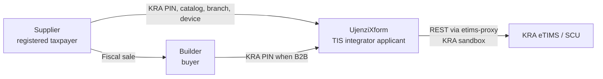
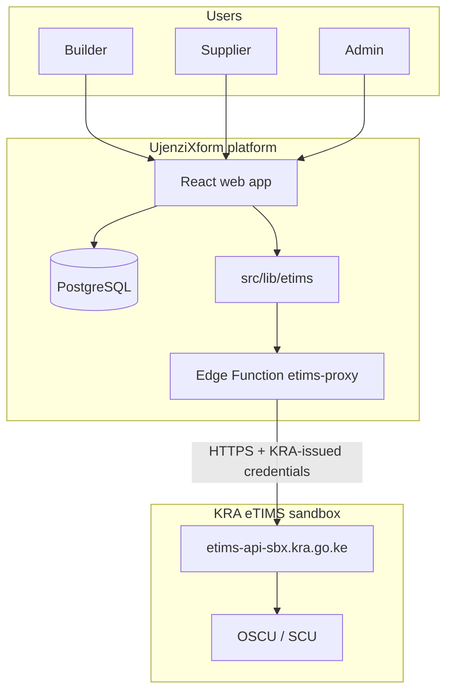
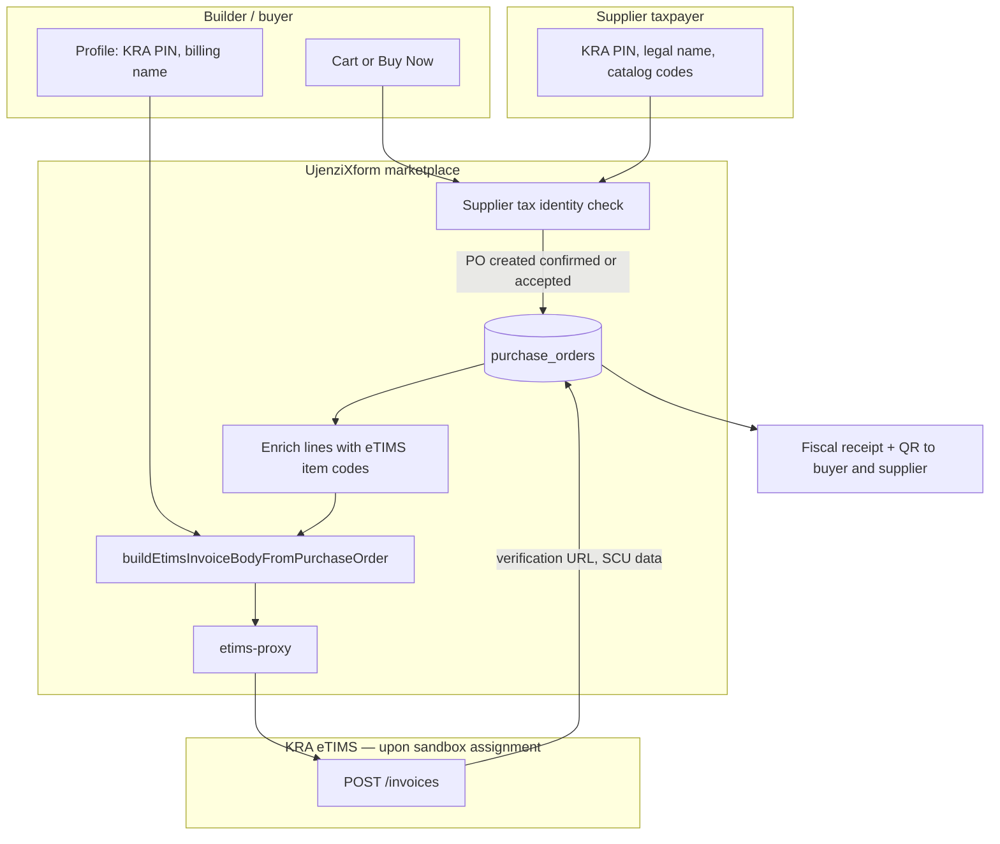
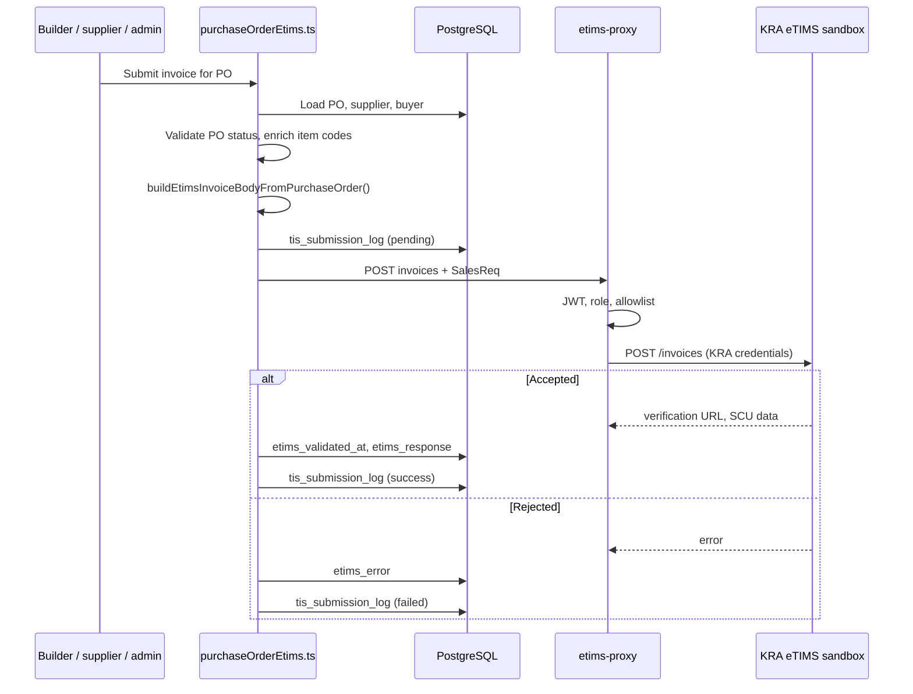
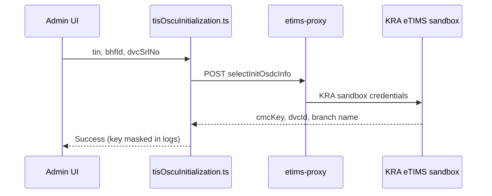
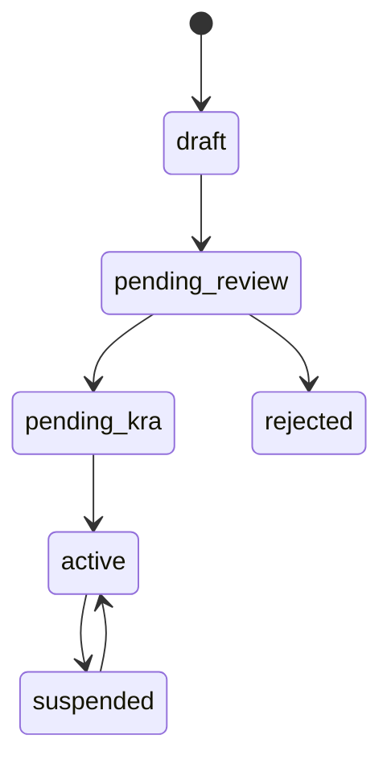
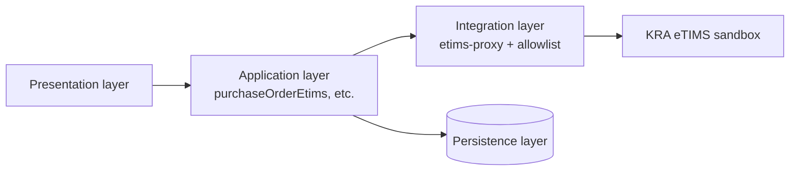
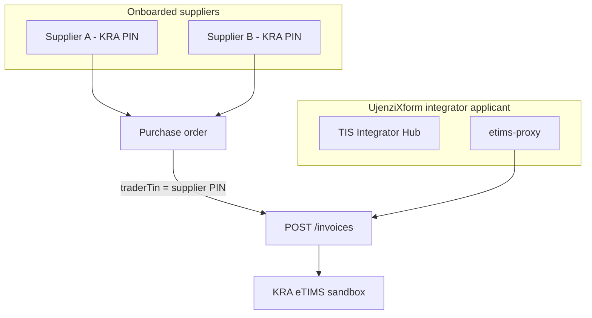

# Technology Architecture: UjenziXform TIS Integration with KRA eTIMS

**Prepared for:** Kenya Revenue Authority (KRA) — third-party integrator sandbox application  
**Platform:** UjenziXform (construction materials marketplace, Kenya)  
**TIS product name:** UjenziXform Trader Invoicing System (TIS)  
**Organisation name:** UjenziXform Solution  
**Registered address:** Barngetuny Plaza Left Wing 3rd Floor Room 10, Ronald Ngala Street, Eldoret. P. O. Box 4146 - 30100 Eldoret  
**TIS product version:** 1.0.0  
**Solution type:** OSCU (Online Sales Control Unit) — primary; VSCU initialization paths supported in code  
**Sandbox status:** **Not yet assigned** — UjenziXform is applying for KRA eTIMS sandbox access  
**Target sandbox URL:** `https://etims-api-sbx.kra.go.ke`  
**Certification status:** **Applicant / in development** — seeking KRA sandbox access and subsequent integrator certification  
**Document version:** 3.3  
**Date:** 3 June 2026  

> **One-page overview:** See [`EXECUTIVE_SUMMARY.md`](EXECUTIVE_SUMMARY.md) in this pack.  
> **Sample API payload:** See [`appendix/APPENDIX_SAMPLE_SALESREQ.md`](appendix/APPENDIX_SAMPLE_SALESREQ.md).

> **Scope:** This document describes **how UjenziXform will integrate with KRA eTIMS** once KRA assigns sandbox access to us as a **potential third-party TIS integrator**. It is a forward-looking architecture submission — not a report of live sandbox operations.

---

## Table of contents

1. [Purpose of this document](#1-purpose-of-this-document)
2. [What UjenziXform is](#2-what-ujenzixform-is)
3. [What the TIS does](#3-what-the-tis-does)
4. [Integrator application status](#4-integrator-application-status)
5. [Parties and responsibilities](#5-parties-and-responsibilities)
6. [Integration architecture](#6-integration-architecture)
7. [Marketplace purchase flow → POST /invoices](#7-marketplace-purchase-flow--post-invoices)
8. [Sales invoice flow (KRA sandbox)](#8-sales-invoice-flow-kra-sandbox)
9. [OSCU initialization flow](#9-oscu-initialization-flow)
10. [Vendor (supplier) onboarding flow](#10-vendor-supplier-onboarding-flow)
11. [Credit notes](#11-credit-notes)
12. [Master data and catalog](#12-master-data-and-catalog)
13. [Technical architecture layers](#13-technical-architecture-layers)
14. [API integration (etims-proxy)](#14-api-integration-etims-proxy)
15. [Sales invoice payload mapping](#15-sales-invoice-payload-mapping)
16. [Data stored in the platform](#16-data-stored-in-the-platform)
17. [Multi-vendor (multi-taxpayer) model](#17-multi-vendor-multi-taxpayer-model)
18. [Security controls](#18-security-controls)
19. [Fiscal receipt shown to buyers](#19-fiscal-receipt-shown-to-buyers)
20. [Audit, errors, and retry](#20-audit-errors-and-retry)
21. [Post-sandbox-assignment plan](#21-post-sandbox-assignment-plan)
22. [Implementation readiness matrix](#22-implementation-readiness-matrix)
23. [KRA certification checklist mapping](#23-kra-certification-checklist-mapping)
24. [Source code references](#24-source-code-references)
25. [Appendix — sample SalesReq payload](#25-appendix--sample-salesreq-payload)
26. [Document control](#26-document-control)

---

## 1. Purpose of this document

This document accompanies UjenziXform’s **application for KRA eTIMS sandbox access** as a **potential third-party Trader Invoicing System (TIS) integrator**.

It explains:

- **What UjenziXform is** and why we require eTIMS integration
- **How we will connect to KRA eTIMS** after KRA issues sandbox credentials
- The **TIS software we have developed** in preparation (secure proxy, purchase-order mapping, fiscal receipt UI, audit, vendor onboarding)

We do **not** claim that KRA sandbox access or integrator certification has already been granted.

---

## 2. What UjenziXform is

**UjenziXform** is a web platform that connects:

| User type | Role |
|-----------|------|
| **Builders** | Buy construction materials; create and accept purchase orders (POs) |
| **Suppliers** | Sell materials; hold catalog, pricing, and tax identity |
| **Administrators** | Operate the marketplace and TIS integrator tools |

Typical transaction: a builder selects materials from a supplier, a **purchase order** is created and accepted, payment may follow (e.g. Paystack), and delivery workflows may apply. **KRA fiscal invoicing will be tied to the purchase order**, not to a separate internal invoice module.

The platform is designed so that the **eTIMS fiscal response** becomes the tax receipt for supplier sales once KRA sandbox testing and certification are complete.

---

## 3. What the TIS does

The **UjenziXform Trader Invoicing System (TIS)** will:

1. Collect **supplier tax identity** (KRA PIN, legal name, branch, device serial where required)
2. Map **purchase order line items** to KRA item codes and tax metadata
3. Submit **sales invoices** and **credit notes** to **KRA eTIMS** via REST (`POST /invoices`)
4. Store the **KRA/SCU response** (verification URL, control unit reference, JSON snapshot)
5. Display a **fiscal receipt with QR code** to buyers and suppliers
6. Log submissions for **admin review and retry**

TIS is the **eTIMS compliance layer** embedded in UjenziXform order workflows — not a standalone accounting product.

---

## 4. Integrator application status

| Item | Value |
|------|--------|
| Applicant name | UjenziXform Solution |
| Registered address | Barngetuny Plaza Left Wing 3rd Floor Room 10, Ronald Ngala Street, Eldoret. P. O. Box 4146 - 30100 Eldoret |
| Platform | UjenziXform |
| Product name | UjenziXform Trader Invoicing System (TIS) |
| Product version | 1.0.0 |
| Solution type | OSCU |
| **KRA eTIMS sandbox** | **Not yet assigned — applying for access** |
| Target sandbox URL | `https://etims-api-sbx.kra.go.ke` |
| Target production URL | `https://etims-api.kra.go.ke` (only after KRA certification) |
| Integrator certification | **Not held** — applicant in development |

UjenziXform is registering on the eTIMS portal and submitting this architecture as part of our request to be recognised as a **potential third-party TIS integrator** and to receive **KRA-assigned sandbox credentials**.

---

## 5. Parties and responsibilities

| Party | Responsibility |
|-------|----------------|
| **KRA** | Sandbox access, eTIMS policy, SCU, integrator approval |
| **UjenziXform** | TIS software, secure API gateway, vendor onboarding, audit |
| **Supplier** | Accurate KRA PIN, legal name, item codes; issues fiscal sale |
| **Builder** | Optional KRA PIN; receives fiscal receipt for verification |

Each invoice will carry the **supplier’s KRA PIN** as `traderTin` — the **vendor taxpayer** is the issuer, not UjenziXform’s PIN alone.

---

## 6. Integration architecture

Once KRA assigns sandbox access, integration will work as follows:

KRA-issued credentials will be stored as **server-side Edge secrets only**. The browser will never see them.

---

## 7. Marketplace purchase flow → POST /invoices

**Yes — POST /invoices is part of the current UjenziXform purchase flow.** TIS does not receive orders from outside the platform. A **purchase order (PO)** is the business document; TIS maps that PO to KRA **SalesReq** and submits it via `POST /invoices`.

This section describes the **current marketplace design** (how buyers and suppliers work today). Once KRA assigns sandbox access, the same flow will call **KRA eTIMS sandbox** instead of any other endpoint.

### 7.1 End-to-end path (current design)

### 7.2 Purchase paths on UjenziXform today

| Path | What happens | Leads to POST /invoices? |
|------|----------------|---------------------------|
| **Cart → Buy Now** | Builder selects supplier, passes tax-identity check, PO created with status `confirmed` | **Yes** — automatic TIS submit after PO save (`CartSidebar`) |
| **Materials grid → Buy Now** | Direct single-item purchase, PO status `confirmed` | **Yes** — automatic TIS submit (`MaterialsGrid`) |
| **Quote workflow** | PO progresses through quote statuses until builder accepts | **When accepted** — PO must leave quote-pending statuses; supplier or admin can submit manually |
| **Supplier Order Management** | Supplier opens accepted PO | **Yes** — manual “Submit to KRA eTIMS” button |
| **Admin TIS / eTIMS tools** | Staff retry or test on a PO | **Yes** — manual submit / retry |

**Not wired today:** automatic submit on quote accept (function exists in code but has no UI caller).

### 7.3 Gates before POST /invoices

| Gate | Rule |
|------|------|
| **Supplier tax identity** | Valid `kra_pin` and legal business name (`assertSupplierTaxIdentityForCheckout`) |
| **PO status** | Blocked while `pending`, `draft`, or any `quote_*` / `quoted` status |
| **Line item codes** | Every PO line must resolve to an `etims_item_code` (from line JSON or catalog) |
| **Buyer identity** | `profiles.kra_pin` and billing name used as `customerPin` / `customerName` when present |

If a gate fails, TIS **does not call** POST /invoices; the error is stored on `purchase_orders.etims_error`.

### 7.4 What POST /invoices sends (from the PO)

The PO is the single source for the integrator payload:

- **Header:** supplier KRA PIN (`traderTin`), supplier legal name, buyer PIN/name, PO number as `traderInvoiceNo`, totals, payment type, receipt type `S`
- **Lines:** `salesItems[]` from PO `items` JSON — quantity, unit price, amount, tax code, item code from catalog enrichment

Internal draft `invoices` rows on quote accept were **removed** (May 2026). The **eTIMS fiscal response** on the PO is the intended tax receipt for supplier sales.

---

## 8. Sales invoice flow (KRA sandbox)

### 8.1 Steps (upon KRA sandbox assignment)

| Step | Action |
|------|--------|
| 1 | Supplier completes KRA PIN and legal business name |
| 2 | Catalog lines have KRA **item codes** |
| 3 | Builder’s PO reaches **accepted/confirmed** status |
| 4 | TIS builds **SalesReq** from the PO |
| 5 | `etims-proxy` → `POST /invoices` on **KRA sandbox** |
| 6 | KRA returns SCU reference and **verification URL** |
| 7 | Response saved on PO; **fiscal receipt + QR** shown |
| 8 | Event logged in `tis_submission_log` |

### 8.2 Sequence diagram

### 8.3 Submission triggers (current design)

| Trigger | TIS design |
|---------|------------|
| Order confirmation / checkout | Automatic submit after PO confirmed |
| Supplier manual submit | Supplier dashboard action |
| Admin operations | Admin TIS tools for retry and testing |

PO statuses that **will block** submission until accepted: `pending`, `draft`, `quote_created`, `quote_received_by_supplier`, `quote_responded`, `quote_revised`, `quote_viewed_by_builder`, `quoted`.

---

## 9. OSCU initialization flow

After KRA assigns sandbox access, vendor devices will be initialized via the admin **TIS Integrator Hub**:

| Field | Meaning |
|-------|---------|
| `tin` | Vendor/supplier KRA PIN |
| `bhfId` | Branch code (e.g. `00`) |
| `dvcSrlNo` | KRA sandbox device serial |

Communication keys will **never be stored in plain text** in the database.

---

## 10. Vendor (supplier) onboarding flow

Administrators will track each supplier in `tis_vendor_onboarding`. Status `pending_kra` covers KRA-related steps (device init, item registration) under UjenziXform’s integrator application.

**Before first sandbox invoice:** valid supplier KRA PIN, legal name, item codes on all PO lines, buyer PIN when B2B.

---

## 11. Credit notes

Credit notes will use the same `POST /invoices` endpoint on KRA sandbox with `receiptTypeCode: R` and `traderOrgInvoiceNo` referencing the original sale. Requires a prior successful sale on the PO.

---

## 12. Master data and catalog

Before sandbox sales, each PO line will require a KRA **item code** (from PO line, `supplier_product_prices`, `materials`, or admin catalog). Item registration (`POST /items`), customer registration (`POST /customers`), and reference-data sync will be performed against **KRA sandbox** through the allowlisted proxy and admin Integrator API console.

---

## 13. Technical architecture layers

| Layer | Technology |
|-------|------------|
| Frontend | React 18, TypeScript, Vite |
| Backend | Supabase PostgreSQL, Auth, Row Level Security |
| Gateway | Supabase Edge Function `etims-proxy` |
| Client library | `src/lib/etims/*` |

---

## 14. API integration (etims-proxy)

All outbound KRA traffic will use one Edge Function calling `{ETIMS_BASE_URL}/{path}` with HTTP Basic authentication.

**Planned configuration after sandbox assignment:**

| Edge secret | Value |
|-------------|--------|
| `ETIMS_BASE_URL` | `https://etims-api-sbx.kra.go.ke` (no trailing slash) |
| `ETIMS_BASIC_USER` | Issued by KRA |
| `ETIMS_BASIC_PASSWORD` | Issued by KRA |

Allowlisted paths match KRA OSCU REST specification: initialization, reference data, items, customers, invoices, stock/purchase/import sync (`supabase/functions/_shared/etimsPathAllowlist.ts`).

**Access controls:** JWT required; roles `supplier`, `admin`, or `super_admin`; SSRF path allowlist; 400 KB body limit.

---

## 15. Sales invoice payload mapping

| Integrator field | UjenziXform source |
|------------------|-------------------|
| `traderInvoiceNo` | PO number |
| `traderTin` / `sellerPin` | Supplier `kra_pin` |
| `traderName` | Supplier legal / company name |
| `customerPin` | Buyer `profiles.kra_pin` |
| `salesItems[].itemCode` | Catalog / PO `etims_item_code` |
| `receiptTypeCode` | `S` (sale) or `R` (credit note) |
| `paymentType` | Supplier default or `01` |
| `salesDate` | `yyyyMMddHHmmss` at submission |
| `currency` | Default `KES` |

---

## 16. Data stored in the platform

| Store | Purpose |
|-------|---------|
| `purchase_orders` (`etims_*`) | Fiscal submission outcome per order |
| `suppliers` | Vendor tax identity, branch, device serial |
| `profiles` | Buyer KRA PIN and billing identity |
| `tis_integrator_platform` | Integrator metadata and certification checklist |
| `tis_vendor_onboarding` | Per-supplier onboarding lifecycle |
| `tis_submission_log` | Submission audit trail |

**Not stored:** KRA credentials, communication keys in plain text, secrets in browser code.

---

## 17. Multi-vendor (multi-taxpayer) model

UjenziXform will operate **one integrator registration** and serve **many supplier taxpayers** on the same marketplace. Each invoice will use that supplier’s KRA PIN as `traderTin`.

---

## 18. Security controls

| Control | Implementation |
|---------|----------------|
| Credential isolation | KRA credentials in Supabase Edge secrets only |
| Authentication | Supabase JWT on every proxy call |
| Authorization | Roles: supplier, admin, super_admin |
| SSRF prevention | Strict path allowlist |
| RLS | TIS admin tables via `is_tis_integrator_staff()` |
| Key handling | OSCU communication keys redacted in audit logs |
| Request limit | 400 KB max proxy body |

---

## 19. Fiscal receipt shown to buyers

After a successful KRA submission, `EtimsFiscalReceiptView` will display:

- Issuer name and KRA PIN  
- Trader invoice number and SCU-related fields  
- Line items and totals  
- **Verification URL** and **QR code** for KRA public validation  

---

## 20. Audit, errors, and retry

| Mechanism | Purpose |
|-----------|---------|
| `tis_submission_log` | Per-submission audit (type, status, error, response) |
| `purchase_orders.etims_error` | Latest failure on the order |
| Admin Submission Ops | Staff retry and monitoring |
| Supplier dashboard | Manual submit and credit note |

---

## 21. Post-sandbox-assignment plan

Once KRA issues sandbox credentials, UjenziXform will:

| Step | Action |
|------|--------|
| 1 | Configure Edge secrets with KRA-issued sandbox credentials |
| 2 | Set `ETIMS_BASE_URL` to `https://etims-api-sbx.kra.go.ke` |
| 3 | Set platform environment to `sandbox_testing` |
| 4 | Complete OSCU initialization with KRA sandbox device serials |
| 5 | Register test items and customers on sandbox |
| 6 | Execute sales invoice and credit note test cases |
| 7 | Complete internal certification checklist |
| 8 | Submit sandbox test results to KRA for integrator approval |
| 9 | Production cutover only after formal KRA certification |

---

## 22. Implementation readiness matrix

| Capability | Readiness | Notes |
|------------|-----------|-------|
| Secure `etims-proxy` gateway | **Ready** | Awaiting KRA sandbox URL and credentials |
| PO → sales invoice / credit note mapping | **Ready** | To be validated on KRA sandbox |
| Fiscal receipt + QR UI | **Ready** | |
| OSCU initialization flow | **Ready** | To run on KRA sandbox |
| Vendor onboarding workflow | **Ready** | |
| Submission audit logging | **Ready** | |
| Certification checklist tracking | **Ready** | Admin TIS Integrator Hub |
| **KRA sandbox access** | **Pending** | **Subject of this application** |
| KRA integrator certification | **Pending** | After successful sandbox testing |
| Production eTIMS | **Future** | After KRA approval |

---

## 23. KRA certification checklist mapping

To be completed on **KRA-assigned sandbox** after access is granted:

| ID | Requirement |
|----|-------------|
| `platform_registered` | eTIMS portal integrator registration |
| `sandbox_access` | KRA-issued sandbox credentials |
| `oscu_vscu_init` | Device initialization on KRA sandbox |
| `master_data_sync` | Reference data endpoints |
| `item_registration` | POST /items |
| `customer_registration` | POST /customers |
| `sales_invoice` | POST /invoices type S |
| `credit_note` | POST /invoices type R |
| `fiscal_receipt_ui` | Receipt + QR display |
| `vendor_tis_identity` | Per-supplier PIN, branch, device |
| `vendor_onboarding_workflow` | Onboarding lifecycle |
| `submission_audit` | Logging and retry |
| `secure_credentials` | Server-side Edge secrets |
| `production_cutover` | After KRA certification |

---

## 24. Source code references

| Component | Path |
|-----------|------|
| Edge proxy | `supabase/functions/etims-proxy/index.ts` |
| Path allowlist | `supabase/functions/_shared/etimsPathAllowlist.ts` |
| PO → invoice | `src/lib/etims/purchaseOrderEtims.ts` |
| OSCU init | `src/lib/etims/tisOscuInitialization.ts` |
| Audit log | `src/lib/etims/logTisSubmission.ts` |
| Admin hub | `src/components/admin/tis-integrator/TisIntegratorHub.tsx` |
| Platform DB | `supabase/migrations/20260525120000_tis_integrator_platform.sql` |

---

## 25. Appendix — sample SalesReq payload

KRA reviewers often require a concrete example of the **`POST /invoices`** body. UjenziXform provides a separate appendix (anonymised, illustrative PINs and item codes):

| File | Contents |
|------|----------|
| [`appendix/APPENDIX_SAMPLE_SALESREQ.md`](appendix/APPENDIX_SAMPLE_SALESREQ.md) | HTTP call, field mapping, credit note variant, response shape |
| [`appendix/APPENDIX_SAMPLE_SALESREQ.json`](appendix/APPENDIX_SAMPLE_SALESREQ.json) | Full sales invoice JSON (two PO lines) |

**Summary:** A confirmed UjenziXform PO (e.g. `PO-2026-004821`) maps to SalesReq with supplier `traderTin`, buyer `customerPin`, and `salesItems[]` from catalog `etims_item_code` values. See appendix for the complete payload and PO-field mapping table.

---

## 26. Document control

| Version | Date | Changes |
|---------|------|---------|
| 1.0 | 2026-06-03 | Initial draft |
| 2.0 | 2026-06-03 | KRA presentation: business context, maturity matrix |
| 3.0 | 2026-06-03 | Sandbox application framing |
| 3.1 | 2026-06-03 | Application-only narrative |
| 3.2 | 2026-06-03 | Marketplace purchase flow → POST /invoices |
| 3.3 | 2026-06-03 | Executive summary + SalesReq appendix (separate files) |

---

*This document describes how UjenziXform will integrate with KRA eTIMS as a potential third-party TIS integrator after sandbox access is granted. For authoritative API contracts, refer to the official KRA eTIMS OSCU/VSCU Technical Specification.*
