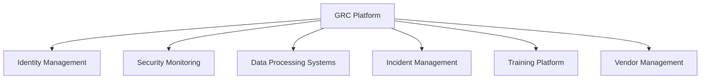

# 📋 UjenziPro12 Compliance Audit Framework

## Overview

This comprehensive compliance audit framework ensures UjenziPro12 maintains adherence to applicable laws, regulations, and industry standards. The framework provides structured processes for ongoing compliance monitoring, periodic assessments, and continuous improvement.

## 🎯 Compliance Objectives

- **Legal Adherence**: Maintain compliance with Kenya Data Protection Act 2019 and GDPR
- **Risk Mitigation**: Identify and address compliance gaps proactively
- **Continuous Monitoring**: Implement ongoing compliance assessment processes
- **Documentation**: Maintain comprehensive compliance documentation
- **Stakeholder Assurance**: Provide confidence to customers, partners, and regulators

## 📚 Regulatory Framework

### **Primary Regulations**

#### **🇰🇪 Kenya Data Protection Act 2019**
- **Scope**: Personal data processing in Kenya
- **Key Requirements**:
  - Data Controller registration
  - Lawful basis for processing
  - Data subject rights implementation
  - Cross-border transfer restrictions
  - Breach notification (72 hours)
  - Data Protection Impact Assessments (DPIA)

#### **🇪🇺 General Data Protection Regulation (GDPR)**
- **Scope**: EU residents' personal data
- **Key Requirements**:
  - Privacy by design and default
  - Data minimization principles
  - Consent management
  - Right to be forgotten
  - Data portability
  - Supervisory authority cooperation

### **Industry Standards**

#### **ISO 27001:2013 - Information Security Management**
- **Scope**: Information security management system
- **Key Controls**:
  - Risk assessment and treatment
  - Security policy framework
  - Asset management
  - Access control
  - Incident management

#### **SOC 2 Type II - Service Organization Controls**
- **Scope**: Service organization security controls
- **Trust Criteria**:
  - Security
  - Availability
  - Processing integrity
  - Confidentiality
  - Privacy

## 🔍 Audit Methodology

### **1. Compliance Assessment Framework**

#### **Risk-Based Approach**
```
COMPLIANCE RISK MATRIX

                 Low Impact    Medium Impact    High Impact
High Likelihood      Medium        High          Critical
Med Likelihood       Low          Medium         High
Low Likelihood       Low           Low           Medium
```

#### **Assessment Frequency**
- **Critical Controls**: Monthly
- **High-Risk Areas**: Quarterly
- **Medium-Risk Areas**: Semi-annually
- **Low-Risk Areas**: Annually
- **Ad-hoc**: Triggered by changes or incidents

### **2. Audit Process Workflow**

#### **Phase 1: Planning (Week 1)**
1. **Scope Definition**
   - Identify applicable regulations
   - Define audit boundaries
   - Select assessment criteria
   - Assign audit team

2. **Resource Allocation**
   - Audit team assignment
   - Timeline development
   - Tool and system access
   - Documentation preparation

#### **Phase 2: Fieldwork (Weeks 2-3)**
1. **Evidence Collection**
   - Document review
   - System testing
   - Interview stakeholders
   - Process observation

2. **Control Testing**
   - Design effectiveness
   - Operating effectiveness
   - Compensating controls
   - Gap identification

#### **Phase 3: Reporting (Week 4)**
1. **Findings Analysis**
   - Gap assessment
   - Risk evaluation
   - Impact analysis
   - Remediation planning

2. **Report Generation**
   - Executive summary
   - Detailed findings
   - Recommendations
   - Action plans

#### **Phase 4: Follow-up (Ongoing)**
1. **Remediation Tracking**
   - Action plan monitoring
   - Progress reporting
   - Validation testing
   - Closure verification

## 📊 Compliance Monitoring Program

### **Continuous Monitoring Controls**

#### **Automated Monitoring**
```yaml
# Compliance Monitoring Dashboard
monitoring_controls:
  data_processing:
    - consent_tracking
    - data_retention_policies
    - cross_border_transfers
    - subject_access_requests
  
  security_controls:
    - access_management
    - encryption_status
    - vulnerability_management
    - incident_response
  
  operational_controls:
    - policy_compliance
    - training_completion
    - vendor_assessments
    - audit_findings
```

#### **Key Performance Indicators (KPIs)**
- **Compliance Score**: Overall compliance percentage
- **Control Effectiveness**: Percentage of controls operating effectively
- **Remediation Rate**: Time to fix compliance gaps
- **Training Completion**: Staff compliance training completion rate
- **Incident Response**: Compliance incident response time

### **Manual Review Processes**

#### **Monthly Reviews**
- Data processing activities
- Consent management effectiveness
- Security incident analysis
- Policy compliance assessment
- Vendor compliance status

#### **Quarterly Reviews**
- Comprehensive control testing
- Risk assessment updates
- Regulatory change impact
- Third-party assessments
- Management reporting

## 🔧 Compliance Tools and Systems

### **Governance, Risk, and Compliance (GRC) Platform**

#### **Core Capabilities**
- **Policy Management**: Centralized policy repository
- **Risk Assessment**: Automated risk scoring
- **Control Monitoring**: Real-time control status
- **Audit Management**: End-to-end audit workflow
- **Reporting**: Automated compliance reporting

#### **Integration Points**


### **Compliance Automation Tools**

#### **Data Privacy Automation**
- **Consent Management**: Automated consent tracking
- **Data Mapping**: Automated data flow discovery
- **Subject Rights**: Automated request processing
- **Retention Management**: Automated data deletion

#### **Security Compliance**
- **Vulnerability Scanning**: Automated security assessments
- **Configuration Management**: Baseline compliance checking
- **Access Reviews**: Automated access certification
- **Audit Logging**: Comprehensive activity monitoring

## 📋 Audit Checklists

### **Kenya Data Protection Act 2019 Compliance Checklist**

#### **Data Controller Obligations**
- [ ] **Registration**: Data Controller registered with ODPC
- [ ] **Lawful Basis**: Documented lawful basis for all processing
- [ ] **Privacy Notice**: Clear and accessible privacy notices
- [ ] **Consent**: Valid consent mechanisms where required
- [ ] **Data Minimization**: Processing limited to necessary data
- [ ] **Purpose Limitation**: Processing for specified purposes only
- [ ] **Retention**: Data retention schedules implemented
- [ ] **Security**: Appropriate technical and organizational measures

#### **Data Subject Rights**
- [ ] **Access**: Procedures for subject access requests
- [ ] **Rectification**: Data correction mechanisms
- [ ] **Erasure**: Right to be forgotten implementation
- [ ] **Portability**: Data export capabilities
- [ ] **Objection**: Opt-out mechanisms
- [ ] **Restriction**: Processing limitation procedures

#### **Cross-Border Transfers**
- [ ] **Adequacy**: Transfers to adequate jurisdictions only
- [ ] **Safeguards**: Appropriate safeguards for other transfers
- [ ] **Documentation**: Transfer documentation maintained
- [ ] **Monitoring**: Ongoing transfer monitoring

#### **Breach Management**
- [ ] **Detection**: Breach detection procedures
- [ ] **Assessment**: Breach impact assessment process
- [ ] **Notification**: 72-hour ODPC notification procedure
- [ ] **Documentation**: Breach register maintained
- [ ] **Communication**: Data subject notification procedures

### **GDPR Compliance Checklist**

#### **Privacy by Design**
- [ ] **Proactive**: Privacy considerations in system design
- [ ] **Default**: Privacy-protective default settings
- [ ] **Embedded**: Privacy built into system architecture
- [ ] **Full Functionality**: Privacy without compromising functionality
- [ ] **End-to-End**: Privacy throughout data lifecycle
- [ ] **Visibility**: Transparent privacy practices
- [ ] **Respect**: User privacy respected

#### **Accountability**
- [ ] **Documentation**: Comprehensive processing records
- [ ] **Policies**: Data protection policies and procedures
- [ ] **Training**: Staff privacy training program
- [ ] **DPO**: Data Protection Officer appointed (if required)
- [ ] **DPIA**: Data Protection Impact Assessments conducted
- [ ] **Vendor Management**: Third-party processor agreements

### **ISO 27001 Compliance Checklist**

#### **Information Security Management System (ISMS)**
- [ ] **Scope**: ISMS scope defined and documented
- [ ] **Policy**: Information security policy established
- [ ] **Risk Assessment**: Regular risk assessments conducted
- [ ] **Risk Treatment**: Risk treatment plans implemented
- [ ] **Objectives**: Security objectives set and monitored
- [ ] **Resources**: Adequate resources allocated

#### **Security Controls (Annex A)**
- [ ] **A.5**: Information Security Policies
- [ ] **A.6**: Organization of Information Security
- [ ] **A.7**: Human Resource Security
- [ ] **A.8**: Asset Management
- [ ] **A.9**: Access Control
- [ ] **A.10**: Cryptography
- [ ] **A.11**: Physical and Environmental Security
- [ ] **A.12**: Operations Security
- [ ] **A.13**: Communications Security
- [ ] **A.14**: System Acquisition, Development and Maintenance
- [ ] **A.15**: Supplier Relationships
- [ ] **A.16**: Information Security Incident Management
- [ ] **A.17**: Information Security Aspects of Business Continuity Management
- [ ] **A.18**: Compliance

## 📊 Compliance Reporting

### **Executive Dashboard**

#### **Key Metrics**
```
COMPLIANCE SCORECARD

Overall Compliance Score: 95%
┌─────────────────────────────────────┐
│ Kenya DPA 2019:     ████████████ 98%│
│ GDPR:              ███████████  94% │
│ ISO 27001:         ████████████ 96% │
│ SOC 2:             ██████████   92% │
└─────────────────────────────────────┘

Critical Issues: 0
High Priority: 2
Medium Priority: 5
Low Priority: 12
```

#### **Trend Analysis**
- Compliance score trends over time
- Issue resolution rates
- Control effectiveness trends
- Regulatory change impacts

### **Detailed Reporting**

#### **Monthly Compliance Report**
```markdown
# Monthly Compliance Report - [Month Year]

## Executive Summary
- Overall compliance status
- Key achievements
- Critical issues identified
- Upcoming regulatory changes

## Compliance Metrics
- Scorecard by regulation
- KPI performance
- Trend analysis
- Benchmark comparisons

## Risk Assessment
- New risks identified
- Risk mitigation progress
- Residual risk levels
- Risk appetite alignment

## Action Items
- Open remediation items
- Completion timelines
- Resource requirements
- Escalation needs

## Regulatory Updates
- New regulations
- Guidance updates
- Industry developments
- Impact assessments
```

#### **Quarterly Board Report**
- Strategic compliance overview
- Regulatory landscape changes
- Major compliance initiatives
- Investment requirements
- Risk exposure summary

## 🎓 Training and Awareness

### **Compliance Training Program**

#### **Role-Based Training**
- **All Staff**: General compliance awareness
- **Developers**: Privacy by design, secure coding
- **Administrators**: Data protection, access controls
- **Management**: Compliance governance, risk management
- **Legal/Compliance**: Regulatory updates, best practices

#### **Training Schedule**
- **Onboarding**: New employee compliance training
- **Annual**: Mandatory compliance refresher
- **Quarterly**: Regulatory update sessions
- **Ad-hoc**: Change-driven training

### **Awareness Campaigns**
- **Privacy Week**: Annual privacy awareness campaign
- **Security Month**: Cybersecurity awareness activities
- **Compliance Corner**: Regular compliance tips and updates
- **Incident Lessons**: Learning from compliance incidents

## 🔄 Continuous Improvement

### **Improvement Process**

#### **1. Performance Monitoring**
- Regular KPI review
- Trend analysis
- Benchmark comparison
- Stakeholder feedback

#### **2. Gap Analysis**
- Control effectiveness assessment
- Process efficiency review
- Technology capability gaps
- Resource adequacy evaluation

#### **3. Enhancement Planning**
- Improvement opportunity identification
- Cost-benefit analysis
- Implementation planning
- Change management

#### **4. Implementation and Monitoring**
- Project execution
- Progress tracking
- Effectiveness measurement
- Lessons learned capture

### **Innovation and Automation**
- **RegTech Solutions**: Regulatory technology adoption
- **AI/ML**: Automated compliance monitoring
- **Process Automation**: Workflow optimization
- **Predictive Analytics**: Proactive risk identification

## 📞 Governance Structure

### **Compliance Committee**

#### **Composition**
- **Chair**: Chief Compliance Officer
- **Members**:
  - Legal Counsel
  - Chief Information Security Officer
  - Data Protection Officer
  - Chief Technology Officer
  - Chief Financial Officer
  - Business Unit Representatives

#### **Responsibilities**
- Compliance strategy oversight
- Policy approval
- Risk tolerance setting
- Resource allocation
- Regulatory relationship management

### **Reporting Lines**
```
Board of Directors
       ↓
  Audit Committee
       ↓
Compliance Committee
       ↓
┌──────────────────────────────────┐
│ Chief Compliance Officer         │
├──────────────────────────────────┤
│ • Data Protection Officer        │
│ • Compliance Analysts           │
│ • Risk Managers                 │
│ • Audit Coordinators           │
└──────────────────────────────────┘
```

## 📋 Vendor and Third-Party Management

### **Due Diligence Process**

#### **Pre-Engagement Assessment**
- [ ] **Compliance Questionnaire**: Vendor compliance capabilities
- [ ] **Certification Review**: Relevant compliance certifications
- [ ] **Reference Checks**: Customer compliance experiences
- [ ] **Risk Assessment**: Compliance risk evaluation

#### **Contract Requirements**
- [ ] **Data Processing Agreements**: GDPR/Kenya DPA compliant
- [ ] **Security Requirements**: Minimum security standards
- [ ] **Audit Rights**: Right to audit vendor compliance
- [ ] **Breach Notification**: Incident reporting obligations
- [ ] **Compliance Warranties**: Vendor compliance representations

#### **Ongoing Monitoring**
- [ ] **Regular Assessments**: Periodic compliance reviews
- [ ] **Certification Monitoring**: Ongoing certification validity
- [ ] **Incident Tracking**: Vendor compliance incidents
- [ ] **Performance Reviews**: Compliance KPI monitoring

## 🚨 Compliance Incident Management

### **Incident Classification**

#### **Severity Levels**
- **Critical**: Major regulatory violation with significant impact
- **High**: Regulatory violation requiring immediate attention
- **Medium**: Compliance gap with moderate impact
- **Low**: Minor compliance issue with limited impact

### **Response Procedures**

#### **Immediate Response (0-4 hours)**
1. **Incident Assessment**: Determine compliance impact
2. **Containment**: Prevent further compliance violations
3. **Notification**: Alert compliance team and management
4. **Documentation**: Begin incident documentation

#### **Investigation (4-24 hours)**
1. **Root Cause Analysis**: Identify underlying causes
2. **Impact Assessment**: Evaluate full compliance impact
3. **Regulatory Assessment**: Determine reporting obligations
4. **Stakeholder Communication**: Notify affected parties

#### **Resolution (24+ hours)**
1. **Remediation Plan**: Develop corrective actions
2. **Implementation**: Execute remediation measures
3. **Validation**: Verify effectiveness of corrections
4. **Lessons Learned**: Capture improvement opportunities

## 📈 Metrics and KPIs

### **Compliance Performance Metrics**

#### **Quantitative Metrics**
- **Compliance Score**: Overall compliance percentage (Target: >95%)
- **Control Effectiveness**: Percentage of effective controls (Target: >98%)
- **Remediation Time**: Average time to fix issues (Target: <30 days)
- **Training Completion**: Staff training completion rate (Target: 100%)
- **Audit Findings**: Number of audit findings (Target: Decreasing trend)

#### **Qualitative Metrics**
- **Regulatory Relationships**: Quality of regulator interactions
- **Stakeholder Confidence**: Customer and partner trust levels
- **Process Maturity**: Compliance process sophistication
- **Cultural Integration**: Compliance culture embedding

### **Leading Indicators**
- **Risk Assessments**: Frequency and quality of risk assessments
- **Policy Updates**: Timeliness of policy updates
- **Training Effectiveness**: Training quality and retention
- **Proactive Monitoring**: Early issue identification

### **Lagging Indicators**
- **Regulatory Fines**: Penalties and sanctions
- **Audit Results**: External audit findings
- **Incident Frequency**: Compliance incident rates
- **Customer Complaints**: Privacy and compliance complaints

## 📞 Contact Information

### **Compliance Team**
- **Chief Compliance Officer**: compliance-officer@ujenzipro.co.ke
- **Data Protection Officer**: dpo@ujenzipro.co.ke
- **Compliance Analyst**: compliance-analyst@ujenzipro.co.ke
- **Risk Manager**: risk-manager@ujenzipro.co.ke

### **External Contacts**
- **Legal Counsel**: legal@ujenzipro.co.ke
- **External Auditors**: audit-firm@example.com
- **Regulatory Consultants**: regulatory-consultant@example.com

### **Regulatory Authorities**
- **Kenya ODPC**: info@odpc.go.ke, +254-20-2628000
- **EU Supervisory Authorities**: As applicable by jurisdiction

---

## 📚 Appendices

### **Appendix A: Regulatory Mapping Matrix**
[Detailed mapping of regulations to controls and processes]

### **Appendix B: Audit Templates**
[Standardized audit checklists and templates]

### **Appendix C: Training Materials**
[Compliance training resources and materials]

### **Appendix D: Vendor Assessment Tools**
[Third-party compliance assessment questionnaires]

### **Appendix E: Incident Response Playbooks**
[Compliance incident response procedures]

---

**Document Version**: 1.0  
**Last Updated**: October 2025  
**Next Review**: January 2026  
**Owner**: Compliance Team  
**Approver**: Chief Compliance Officer

*This compliance audit framework is a living document that will be updated regularly to reflect regulatory changes, organizational growth, and lessons learned from audit activities.*

