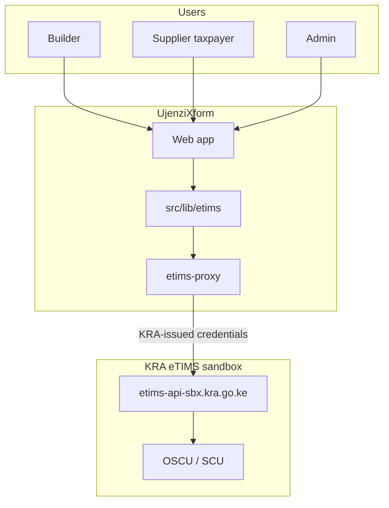

# Flow 1 — Integration context (KRA sandbox)

UjenziXform applies as a **potential third-party TIS integrator**. Diagram shows planned integration **after KRA assigns sandbox access**.

```mermaid
flowchart TB
    subgraph Users
        B[Builder]
        S[Supplier taxpayer]
        A[Admin]
    end

    subgraph UjenziXform
        UI[Web app]
        LIB[src/lib/etims]
        EDGE[etims-proxy]
    end

    subgraph KRA["KRA eTIMS sandbox"]
        SBX[etims-api-sbx.kra.go.ke]
        SCU[OSCU / SCU]
    end

    B & S & A --> UI --> LIB --> EDGE
    EDGE -->|KRA-issued credentials| SBX --> SCU
```
