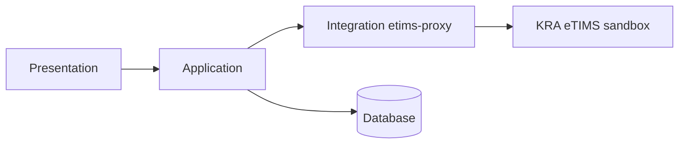

# Flow 2 — Logical architecture layers

```mermaid
flowchart LR
    UI[Presentation] --> APP[Application]
    APP --> INT[Integration etims-proxy]
    APP --> DB[(Database)]
    INT --> KRA[KRA eTIMS sandbox]
```

Layers are designed and ready; KRA sandbox credentials will be configured after assignment.
