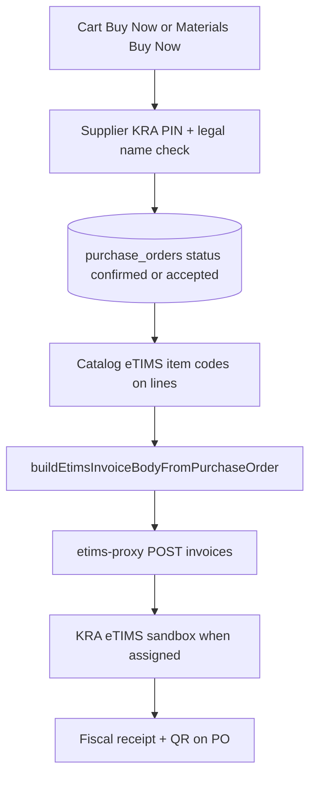

# Flow 3 — Marketplace purchase → POST /invoices (current design)

POST /invoices is triggered from the **purchase order**, not as a standalone action.

| Path | POST trigger |
|------|----------------|
| Cart / Buy Now | Automatic after PO `confirmed` |
| Quote workflow | Manual when PO past quote statuses |
| Supplier dashboard | Manual Submit to KRA eTIMS |
| Admin TIS ops | Manual retry / test |

Blocked PO statuses: pending, draft, quote_created, quote_responded, quoted, etc.
