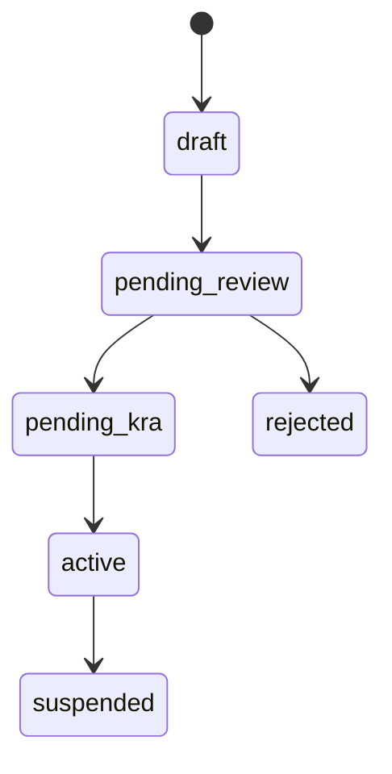

# Flow 5 — Vendor onboarding (supplier taxpayer)

Pending KRA sandbox steps use status `pending_kra`.

Active vendors may issue invoices through TIS once **KRA sandbox** testing is complete for that supplier.
