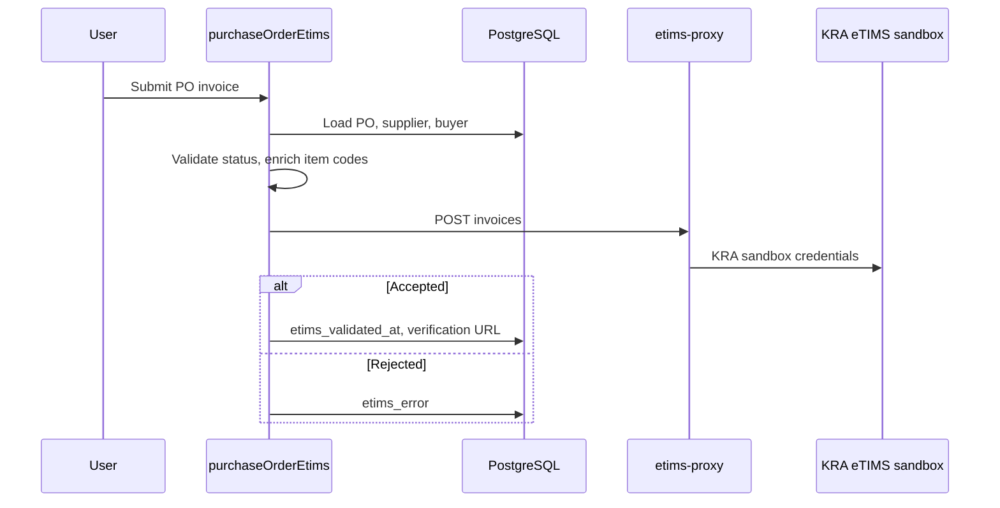

# Flow 3 — Planned sales invoice (KRA sandbox)

```mermaid
sequenceDiagram
    participant User as User
    participant App as purchaseOrderEtims
    participant DB as PostgreSQL
    participant Proxy as etims-proxy
    participant KRA as KRA eTIMS sandbox

    User->>App: Submit PO invoice
    App->>DB: Load PO, supplier, buyer
    App->>App: Validate status, enrich item codes
    App->>Proxy: POST invoices
    Proxy->>KRA: KRA sandbox credentials
    alt Accepted
        App->>DB: etims_validated_at, verification URL
    else Rejected
        App->>DB: etims_error
    end
```

**Triggers (software built):** checkout confirm, supplier manual submit, admin retry.
