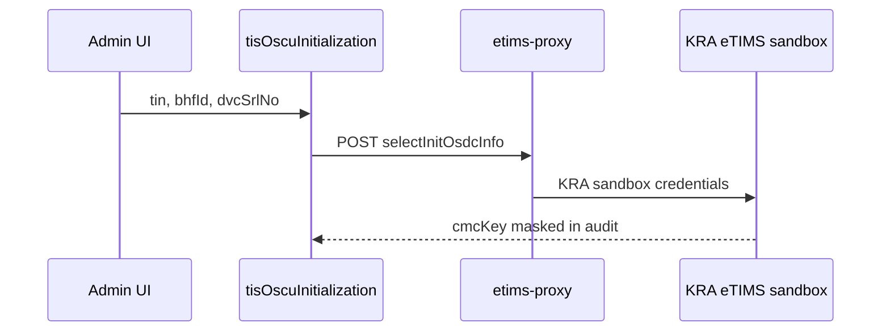

# Flow 4 — Planned OSCU initialization (KRA sandbox)

```mermaid
sequenceDiagram
    participant Admin as Admin UI
    participant Init as tisOscuInitialization
    participant Proxy as etims-proxy
    participant KRA as KRA eTIMS sandbox

    Admin->>Init: tin, bhfId, dvcSrlNo
    Init->>Proxy: POST selectInitOsdcInfo
    Proxy->>KRA: KRA sandbox credentials
    KRA-->>Init: cmcKey masked in audit
```

Uses **KRA sandbox device serials** issued upon sandbox assignment.
