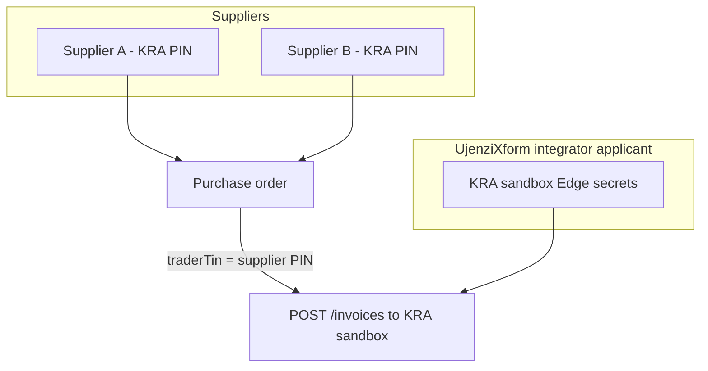

# Flow 6 — Multi-vendor model (KRA sandbox)

```mermaid
flowchart TB
    subgraph Integrator["UjenziXform integrator applicant"]
        SEC[KRA sandbox Edge secrets]
    end

    subgraph Suppliers
        S1[Supplier A - KRA PIN]
        S2[Supplier B - KRA PIN]
    end

    PO[Purchase order]
    S1 & S2 --> PO
    PO -->|traderTin = supplier PIN| INV[POST /invoices to KRA sandbox]
    SEC --> INV
```
