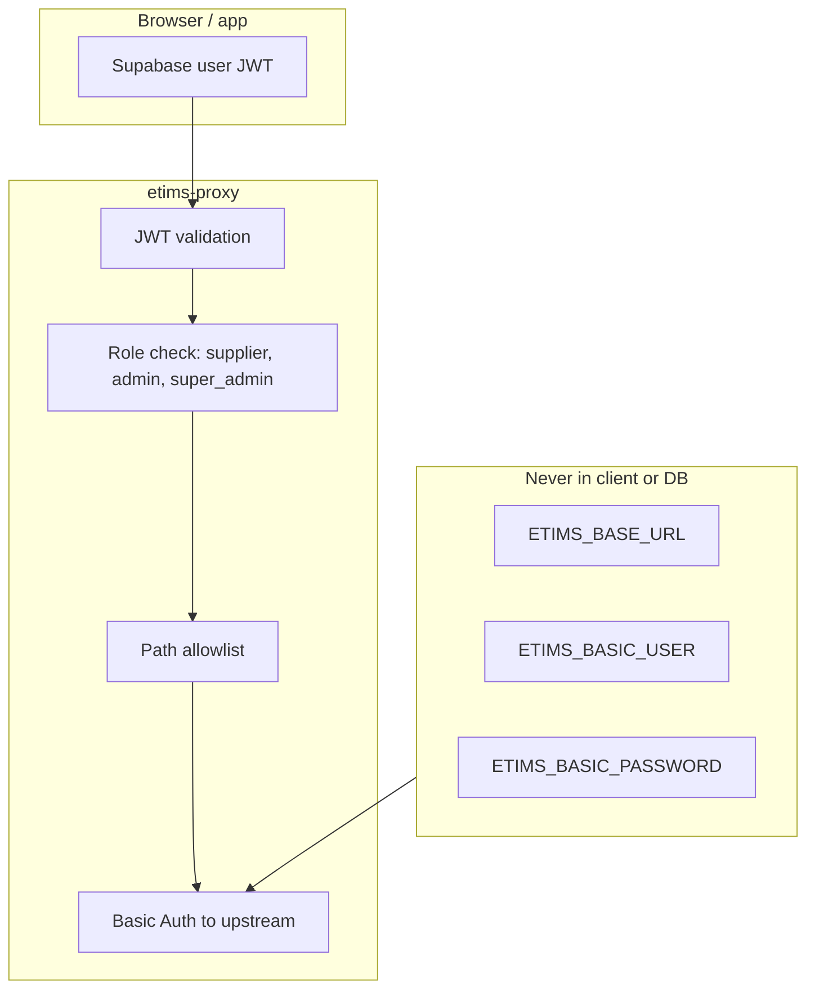

# Flow 7 — Security architecture (etims-proxy)

Credentials never reach the browser.

```mermaid
flowchart TB
    subgraph Client["Browser / app"]
        JWT[Supabase user JWT]
    end

    subgraph Edge["etims-proxy"]
        AUTH[JWT validation]
        ROLE[Role check: supplier, admin, super_admin]
        ALLOW[Path allowlist]
        BASIC[Basic Auth to upstream]
    end

    subgraph Secrets["Never in client or DB"]
        URL[ETIMS_BASE_URL]
        USER[ETIMS_BASIC_USER]
        PASS[ETIMS_BASIC_PASSWORD]
    end

    JWT --> AUTH --> ROLE --> ALLOW --> BASIC
    Secrets --> BASIC
```
